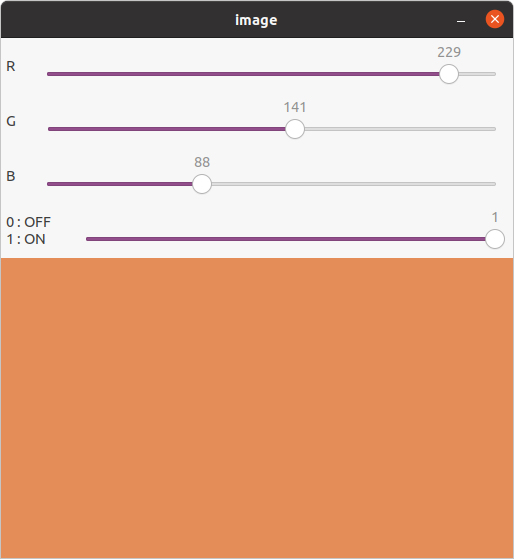

本文主要内容来自于 [OpenCV-Python 教程](https://docs.opencv.org/4.5.5/d6/d00/tutorial_py_root.html) 的 [OpenCV 中的 GUI 功能](https://docs.opencv.org/4.5.5/dc/d4d/tutorial_py_table_of_contents_gui.html) 部分，这个部分的主要内容如下：
<!--more-->
*   [图像操作入门](https://docs.opencv.org/4.5.5/db/deb/tutorial_display_image.html)
    学习加载一幅图像，显示它，并保存它
*   [视频入门](https://docs.opencv.org/4.5.5/dd/d43/tutorial_py_video_display.html)
    学习播放视频，从摄像头捕捉视频，以及写入视频
*   [OpenCV 中的绘制功能](https://docs.opencv.org/4.5.5/dc/da5/tutorial_py_drawing_functions.html)
    学习通过 OpenCV 绘制线、矩形、椭圆形和圆形等等
*   [鼠标作为画笔](https://docs.opencv.org/4.5.5/db/d5b/tutorial_py_mouse_handling.html)
    用鼠标画东西
*   [轨迹栏作为调色板](https://docs.opencv.org/4.5.5/d9/dc8/tutorial_py_trackbar.html)
    创建轨迹栏以控制某些参数

## 目标

 * 学习将轨迹栏绑定到 OpenCV 窗口
 * 我们将学习这些函数： **[cv.getTrackbarPos()](https://docs.opencv.org/4.5.5/d7/dfc/group__highgui.html#ga122632e9e91b9ec06943472c55d9cda8 "Returns the trackbar position. ")**，**[cv.createTrackbar()](https://docs.opencv.org/4.5.5/d7/dfc/group__highgui.html#gaf78d2155d30b728fc413803745b67a9b "Creates a trackbar and attaches it to the specified window. ")** 等等。

## 代码演示程序

这里我们将创建一个简单的应用程序，它展示我们指定的颜色。这个应用中有一个展示颜色的窗口，以及三个轨迹栏以分别指定 B，G 和 R 颜色值。我们滑动轨迹栏并相应地更改窗口颜色。默认情况下，初始颜色将设置为黑色。

对于  **[cv.createTrackbar()](https://docs.opencv.org/4.5.5/d7/dfc/group__highgui.html#gaf78d2155d30b728fc413803745b67a9b "Creates a trackbar and attaches it to the specified window. ")** 函数，第一个参数是轨迹栏的名称，第二个参数是它所附加的窗口的名称，第三个参数是默认值，第四个是最大值，第五个是每次轨迹栏值更改时执行的回调函数。回调函数始终只有一个参数，即轨迹栏的位置。因而在轨迹栏事件的回调函数中，无法区分是绑定的哪个轨迹栏实例所产生的事件。

轨迹栏的另一个重要应用是用作按钮或开关。OpenCV，默认情况下，没有按钮功能。因此，我们可以使用轨迹栏来获得这种功能。在我们的应用程序中，我们创建一个开关，应用程序只要在这个开关打开时才运行，否则屏幕总是黑色的。
```
def trackbar():
    # Create a black image, a window
    img = np.zeros((300, 512, 3), np.uint8)

    switch = True
    blue = 0
    green = 0
    red = 0

    def callback_factory(user_data):
        def callback(pos):
            nonlocal switch, blue, green, red
            if user_data == 'S':
                if pos == 0:
                    switch = False
                else:
                    switch = True
            elif user_data == 'B':
                blue = pos
            elif user_data == 'G':
                green = pos
            elif user_data == 'R':
                red = pos

            if not switch:
                img.fill(0)
            else:
                img[:] = (blue, green, red)
            cv.imshow('image', img)
        return callback

    cv.namedWindow('image')

    # create trackbars for color change
    cv.createTrackbar('R', 'image', 0, 255, callback_factory('R'))
    cv.createTrackbar('G', 'image', 0, 255, callback_factory('G'))
    cv.createTrackbar('B', 'image', 0, 255, callback_factory('B'))
    # create switch for ON/OFF functionality
    switch = '0 : OFF \n1 : ON'
    cv.createTrackbar(switch, 'image', 0, 1, callback_factory('S'))

    cv.imshow('image', img)
    while True:
        k = cv.waitKey(1) & 0xFF
        if k == 27:
            break
    cv.destroyAllWindows()
```

在这个示例程序中，为了及时响应发生的事件，同时也为了降低轮询各个轨迹栏的状态所带来的开销，图像的状态的改变以及绘制，直接在回调中完成。

这里为所有轨迹栏实例只实现了一个回调函数，为了能够在轨迹栏事件回调中区分事件是发生在哪个轨迹栏上的，而通过另一个函数，将回调函数包为闭包。

这里为了演示 **[cv.getTrackbarPos()](https://docs.opencv.org/4.5.5/d7/dfc/group__highgui.html#ga122632e9e91b9ec06943472c55d9cda8 "Returns the trackbar position. ")** 函数的用法，而在回调函数里用了这个函数，但这个调用也可以替换为回调函数的参数中的 pos。

这个应用程序的截屏看起来像下面这样：



OpenCV 提供的窗口等 GUI 接口，仅仅用于一般的示例程序编写，这部分接口的能力和灵活性与 GTK 或 QT 这种专业的 GUI 开发库所提供的能力和灵活性相差甚远。这部分的功能也不是 OpenCV 库的核心，因而也并不值得投入太大的时间和精力来学习。

**参考文档**

[Trackbar as the Color Palette](https://docs.opencv.org/4.5.5/d9/dc8/tutorial_py_trackbar.html)

Done.
