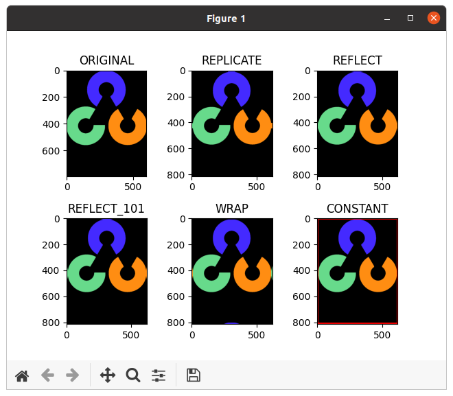

本文主要内容来自于 [OpenCV-Python 教程](https://docs.opencv.org/4.5.5/d6/d00/tutorial_py_root.html) 的 [核心操作](https://docs.opencv.org/4.5.5/d7/d16/tutorial_py_table_of_contents_core.html) 部分，这个部分的主要内容如下：
<!--more-->
*   [图像的基本操作](https://docs.opencv.org/4.5.5/d3/df2/tutorial_py_basic_ops.html)

    学习读取和编辑像素值，使用图像 ROI 和其它的基本操作。

*   [图像的算术运算](https://docs.opencv.org/4.5.5/d0/d86/tutorial_py_image_arithmetics.html)

    对图像执行算术运算

*   [性能测量和提升技术](https://docs.opencv.org/4.5.5/dc/d71/tutorial_py_optimization.html)

    获得解决方案很重要。但是以最快的方式获得它更重要。学习检查代码的速度，优化代码等。

## 目标

学习：

 * 访问像素值并修改它们
 * 访问图像属性
 * 设置感兴趣区域 (ROI)
 * 分割和合并图像

本节中几乎所有的操作都主要与 Numpy 有关，而不是 OpenCV。使用 OpenCV 编写更好的优化的代码需要良好的 Numpy 知识。

## 访问及修改像素值

让我们先加载一幅彩色图像：
```
#!/use/bin/env python

import numpy as np
import cv2 as cv

if __name__ == "__main__":
    cv.samples.addSamplesDataSearchPath("/media/data/my_multimedia/opencv-4.x/samples/data")
    filepath = cv.samples.findFile("messi5.jpg")
    img = cv.imread(filepath)
```

我们可以根据像素点的行和列坐标访问像素的值。对于 BGR 图像，它返回一个蓝色、绿色和红色值的数组。对于灰度图像，只返回相应的亮度。
```
    px = img[100, 100]
    print(px)
    print(px.__class__.__name__)

    blue = img[100, 100, 0]
    print(blue)
```

这几行代码对应的输出如下：
```
[157 166 200]
ndarray
157
```

彩色图像像素点的值是由一个 Numpy 的 ndarray 表示的。我们还可以以相同的方式修改像素值。
```
    img[100, 100] = [255, 255, 255]
    print(img[100, 100])
```

这几行代码对应的输出如下：
```
[255 255 255]
```

**警告**
Numpy 是一个为快速数组计算高度优化的库。因此，简单地访问每个像素值并对其进行修改将非常缓慢，并且不鼓励这样做。

 > **注意**
 > 上面的方法通常用于选择数组的一个区域，比如开始的 5 行和最后的 3 列。对于单独的像素访问，Numpy 数组方法，`array.item()` 和 `array.itemset()` 被认为是更好的选择。它们总是返回一个标量，然而，如果想要访问所有的 B，G，R 值，则将需要为每个值分别调用 `array.item()`。

更好的像素访问和编辑方法：
```
    # accessing RED value
    red_value = img.item(10, 10, 2)
    print(red_value)

    # modifying RED value
    img.itemset((10, 10, 2), 100)

    red_value = img.item(10, 10, 2)
    print(red_value)
```

这几行代码对应的输出如下：
```
59
100
```

## 访问图像的属性

图像属性包括行数、列数和通道数；图像数据的类型；像素的个数等等。

一幅图像的形状可以通过 *img.shape* 访问。它返回行数、列数和通道数的元组（如果图像是彩色的）：
```
    print(img.shape)
```

这行代码对应的输出如下：
```
(342, 548, 3)
```

 > **注意**
 > 如果图像是灰度图，则返回的元组只包含行数和列数，因而这是一种检查加载的图像是灰度图还是彩色图的好方法。

像素值的总个数通过 `img.size` 访问，它是行数、列数和通道数三者的乘积，而不是行数和列数两者的乘积：
```
    print(img.size)
    totoal_pixels = img.shape[0] * img.shape[1] * img.shape[2]
    print(totoal_pixels)
```

这几行代码对应的输出如下：
```
562248
562248
```

图像的数据类型通过 `img.dtype` 获取：
```
    print(img.dtype)
```

这行代码对应的输出如下：
```
uint8
```

 > **注意**
 > `img.dtype` 在调试时非常重要，因为 OpenCV-Python 代码中的大量错误都是由无效的数据类型引起的。

## 图像 ROI

有时，我们将不得不使用某些图像区域。对于图像中的眼睛检测，首先对整个图像进行人脸检测。当获得人脸时，我们只选择人脸区域并在其中搜索眼睛，而不是搜索整个图像。它提高了精度（因为眼睛总是在脸上：D）和性能（因为我们在一个更小的区域内搜索）。

使用 Numpy 索引再次获得 ROI。这里我们选择足球，并把它拷贝到图像的另一个区域：
```
    ball = img[280:340, 330:390]
    img[273:333, 100:160] = ball
```

上面方括号中逗号前面的数字表示选取的区域的行的范围，即区域的垂直方向的范围，后面的数字表示选取的区域的列的范围，即区域的水平方向的范围。检查结果如下：


## 分割和合并图像通道

有时我们需要分别处理一幅图像的 B，G，R 通道。在这种情况下，我们需要把 BGR 图像分割为单独的通道。在其它情况下，我们可能需要合并这些单独的通道，并创建 BGR 图像。我们可以通过以下方式简单地做到这一点：
```
    b, g, r = cv.split(img)
    img = cv.merge((b, r, g))
```

这里有意没有按照原来的数据格式合并数据，而是把所有像素点的绿色通道和红色通道的值做了交换。此外，分割获得的单个色彩通道的值可以作为一幅灰度图来绘制。

或者：
```
    b = img[:, :, 0]
```

假设我们想要把所有像素的红色通道值都设置为 0 —— 我们不需要先分割通道。Numpy 的索引更快：
```
    img[:, :, 2] = 0
```

**警告**
**[cv.split()](https://docs.opencv.org/4.5.5/d2/de8/group__core__array.html#ga0547c7fed86152d7e9d0096029c8518a "Divides a multi-channel array into several single-channel arrays. ")** 是一项代价高昂的操作（就时间而言）。因此只在需要的时候使用它。否则使用 Numpy 的索引。

## 为图像制作边框（填充）

如果要在图像周围创建边框，例如相框，可以使用 **[cv.copyMakeBorder()](https://docs.opencv.org/4.5.5/d2/de8/group__core__array.html#ga2ac1049c2c3dd25c2b41bffe17658a36 "Forms a border around an image. ")**。 但它在卷积运算、零填充等方面有更多应用。此函数接收以下参数：

 * **src** - 输入图像
 * **top**，**bottom**，**left**，**right** - 相应方向上边框的以像素为单位的宽度。
 * **borderType** - 定义了添加何种边框的标记。它可以是以下类型：

     * **[cv.BORDER_CONSTANT](https://docs.opencv.org/4.5.5/d2/de8/group__core__array.html#gga209f2f4869e304c82d07739337eae7c5aed2e4346047e265c8c5a6d0276dcd838 "iiiiii|abcdefgh|iiiiiii with some specified i ")** - 添加一个常量彩色边框。该值应该由下一个参数给出。
     * **[cv.BORDER_REFLECT](https://docs.opencv.org/4.5.5/d2/de8/group__core__array.html#gga209f2f4869e304c82d07739337eae7c5a815c8a89b7cb206dcba14d11b7560f4b "fedcba|abcdefgh|hgfedcb ")** - 边框将是边框元素的镜像，如下所示：*fedcba|abcdefgh|hgfedcb*
     * **[cv.BORDER_REFLECT_101](https://docs.opencv.org/4.5.5/d2/de8/group__core__array.html#gga209f2f4869e304c82d07739337eae7c5ab3c5a6143d8120b95005fa7105a10bb4 "gfedcb|abcdefgh|gfedcba ")** 或 **[cv.BORDER_DEFAULT](https://docs.opencv.org/4.5.5/d2/de8/group__core__array.html#gga209f2f4869e304c82d07739337eae7c5afe14c13a4ea8b8e3b3ef399013dbae01 "same as BORDER_REFLECT_101 ")** - 与上面的相同，但有一点轻微的改变：像这样：*gfedcb|abcdefgh|gfedcba*
     * **[cv.BORDER_REPLICATE](https://docs.opencv.org/4.5.5/d2/de8/group__core__array.html#gga209f2f4869e304c82d07739337eae7c5aa1de4cff95e3377d6d0cbe7569bd4e9f "aaaaaa|abcdefgh|hhhhhhh ")** - 最后一个元素在整个过程中被复制，像这样：*aaaaaa|abcdefgh|hhhhhhh*
     * **[cv.BORDER_WRAP](https://docs.opencv.org/4.5.5/d2/de8/group__core__array.html#gga209f2f4869e304c82d07739337eae7c5a697c1b011884a7c2bdc0e5caf7955661 "cdefgh|abcdefgh|abcdefg ")** - 无法解释，它看起来像这样：*cdefgh|abcdefgh|abcdefg*

 * **value** - 如果边框类型是 [cv.BORDER_CONSTANT](https://docs.opencv.org/4.5.5/d2/de8/group__core__array.html#gga209f2f4869e304c82d07739337eae7c5aed2e4346047e265c8c5a6d0276dcd838 "iiiiii|abcdefgh|iiiiiii with some specified i ") 这个是边框的颜色

下面这段代码演示了所有这些边框类型，以使我们获得更好的理解。
```
def border_type():
    BLUE = [255, 0, 0]

    cv.samples.addSamplesDataSearchPath("/media/data/my_multimedia/opencv-4.x/samples/data")
    filepath = cv.samples.findFile("opencv-logo.png")
    img1 = cv.imread(filepath)

    replicate = cv.copyMakeBorder(img1, 10, 10, 10, 10, cv.BORDER_REPLICATE)
    reflect = cv.copyMakeBorder(img1, 10, 10, 10, 10, cv.BORDER_REFLECT)
    reflect101 = cv.copyMakeBorder(img1, 10, 10, 10, 10, cv.BORDER_REFLECT_101)
    wrap = cv.copyMakeBorder(img1, 10, 10, 10, 10, cv.BORDER_WRAP)
    constant = cv.copyMakeBorder(img1, 10, 10, 10, 10, cv.BORDER_CONSTANT, value=BLUE)

    isolated = cv.copyMakeBorder(img1, 10, 10, 10, 10, cv.BORDER_ISOLATED)

    plt.subplot(231), plt.imshow(img1, 'gray'), plt.title('ORIGINAL')
    plt.subplot(232), plt.imshow(replicate, 'gray'), plt.title('REPLICATE')
    plt.subplot(233), plt.imshow(reflect, 'gray'), plt.title('REFLECT')

    plt.subplot(234), plt.imshow(reflect101, 'gray'), plt.title('REFLECT_101')
    plt.subplot(235), plt.imshow(wrap, 'gray'), plt.title('WRAP')
    plt.subplot(236), plt.imshow(constant, 'gray'), plt.title('CONSTANT')

    plt.subplots_adjust(wspace=0.4, hspace=0.4)

    plt.show()
```

这里用到的示例图像文件同样在 OpenCV 的示例数据中，因而先查找这个文件的完整路径并加载。图像由 matplotlib 显示。因而 RED 和 BLUE 通道将会被交换 。用 matplotlib 画图时，为了防止不同图之间相互遮盖，这里通过 `plt.subplots_adjust(wspace=0.4, hspace=0.4)` 对子图做了一些调整。

来看下最终的结果：



**参考文档**

[Basic Operations on Images](https://docs.opencv.org/4.5.5/d3/df2/tutorial_py_basic_ops.html)

Done.
