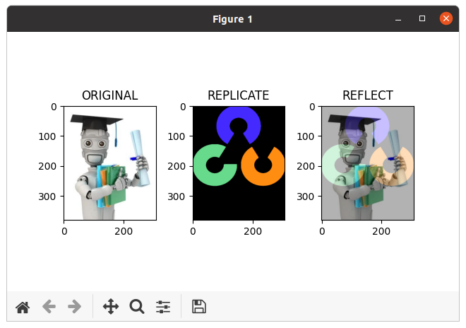
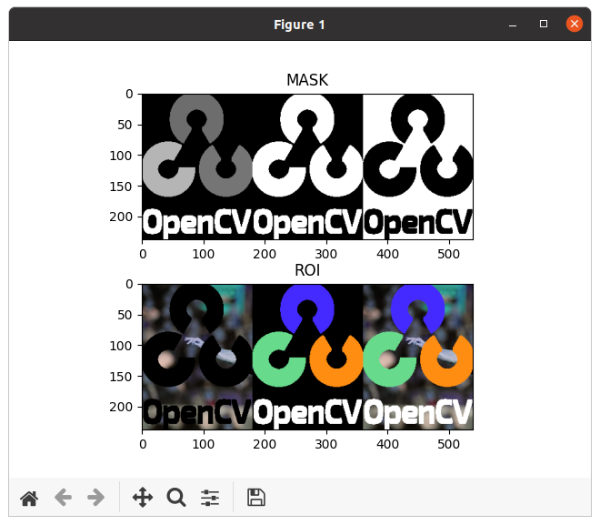

本文主要内容来自于 [OpenCV-Python 教程](https://docs.opencv.org/4.5.5/d6/d00/tutorial_py_root.html) 的 [核心操作](https://docs.opencv.org/4.5.5/d7/d16/tutorial_py_table_of_contents_core.html) 部分，这个部分的主要内容如下：
<!--more-->
*   [图像的基本操作](https://docs.opencv.org/4.5.5/d3/df2/tutorial_py_basic_ops.html)

    学习读取和编辑像素值，使用图像 ROI 和其它的基本操作。

*   [图像的算术运算](https://docs.opencv.org/4.5.5/d0/d86/tutorial_py_image_arithmetics.html)

    对图像执行算术运算

*   [性能测量和提升技术](https://docs.opencv.org/4.5.5/dc/d71/tutorial_py_optimization.html)

    获得解决方案很重要。但是以最快的方式获得它更重要。学习检查代码的速度，优化代码等。

## 目标

 * 学习一些图像的算术运算操作，比如加、减、位运算，等等。
 * 学习这些函数：**[cv.add()](https://docs.opencv.org/4.5.5/d2/de8/group__core__array.html#ga10ac1bfb180e2cfda1701d06c24fdbd6 "Calculates the per-element sum of two arrays or an array and a scalar. ")**，**[cv.addWeighted()](https://docs.opencv.org/4.5.5/d2/de8/group__core__array.html#gafafb2513349db3bcff51f54ee5592a19 "Calculates the weighted sum of two arrays. ")**，等等。

## 图像加法

我们可以利用 OpenCV 的函数，**[cv.add()](https://docs.opencv.org/4.5.5/d2/de8/group__core__array.html#ga10ac1bfb180e2cfda1701d06c24fdbd6 "Calculates the per-element sum of two arrays or an array and a scalar. ")**，或简单地通过 numpy 操作 *res = img1 + img2*，将两幅图像加起来。两幅图像应该具有相同的深度和类型，或者第二幅图像可以仅仅是个标量值。

 > **注意**
 > OpenCV 的加法和 Numpy 的加法是有区别的。OpenCV 加法是饱和运算，而 Numpy 加法是模运算。

比如，考虑下面的例子：
```
def diff_add():
    x = np.uint8([250])
    y = np.uint8([10])

    print(cv.add(x,y)) # 250+10 = 260 => 255
    print(x + y)  # 250+10 = 260 % 256 = 4
```

这几行代码的输出如下：
```
[[255]]
[4]
```

当将两个图像相加时，这将更加明显。坚持使用 OpenCV 函数，因为它们会提供更好的结果。

## 图像混合

这也是一个图像相加操作，但会给不同的图像以不同的权重，为了给人一种混合或透明的感觉。图像相加操作按以下公式进行：

g(x) = (1 - alpha)*f_0(x) + alpha*f_1(x)

通过从 0 -> 1 改变 alpha 的值，我们可以执行一个从一幅图像到另一幅图像之间很酷的转换。
 
这里我们拿两幅图像来混合。给第一个图像一个权重 0.7，给第二个图像一个权重 0.7。 [**cv.addWeighted()**](https://docs.opencv.org/4.5.5/d2/de8/group__core__array.html#gafafb2513349db3bcff51f54ee5592a19 "Calculates the weighted sum of two arrays. ") 对图像应用如下的公式：

dst = alpha * img1 + beta * img2 + gamma

这里的 gamma 我们取 0。
```
def image_blending():
    cv.samples.addSamplesDataSearchPath("/media/data/my_multimedia/opencv-4.x/samples/data")
    file_ml = cv.samples.findFile('ml.png')
    img1 = cv.imread(file_ml)

    file_logo = cv.samples.findFile('opencv-logo.png')
    img2 = cv.imread(file_logo)
    print(img1.shape)
    img2 = cv.resize(img2, (img1.shape[1], img1.shape[0]))
    print(img2.shape)
    dst = cv.addWeighted(img1, 0.7, img2, 0.3, 0)

    plt.subplot(131), plt.imshow(img1, 'gray'), plt.title('ORIGINAL')
    plt.subplot(132), plt.imshow(img2, 'gray'), plt.title('REPLICATE')
    plt.subplot(133), plt.imshow(dst, 'gray'), plt.title('REFLECT')

    plt.subplots_adjust(wspace=0.4, hspace=0.4)

    plt.show()
```

由于上面的两幅图像大小不一样，因而通过 `cv.resize()` 将其中一幅图像的大小做调整，以便后面的混合操作可以正常执行。检查最终的结果如下：



下面这个例子演示如上相同的函数，但引入 **cv.hconcat()** 来将原始图像和结果图像水平拼接起来，以另一种方式展示结果：
```
def image_blending1():
    cv.samples.addSamplesDataSearchPath("/media/data/my_multimedia/opencv-4.x/samples/data")
    file_ml = cv.samples.findFile('ml.png')
    img1 = cv.imread(file_ml)

    file_logo = cv.samples.findFile('opencv-logo.png')
    img2 = cv.imread(file_logo)
    print(img1.shape)
    img2 = cv.resize(img2, (img1.shape[1], img1.shape[0]))
    print(img2.shape)
    dst = cv.addWeighted(img1, 0.7, img2, 0.3, 0)

    images = [img1, img2, dst]
    img4 = cv.hconcat(images)

    cv.imshow('Image', img4)
    cv.waitKey(0)
    cv.destroyAllWindows()
```

检查最终的结果如下：


下面这个示例则通过图像混合，实现一个渐入和渐出的动画效果：
```
def image_blending2():
    cv.samples.addSamplesDataSearchPath("/media/data/my_multimedia/opencv-4.x/samples/data")
    file_ml = cv.samples.findFile('ml.png')
    img1 = cv.imread(file_ml)

    file_logo = cv.samples.findFile('opencv-logo.png')
    img2 = cv.imread(file_logo)
    img2 = cv.resize(img2, (img1.shape[1], img1.shape[0]))

    weight = 0.01
    step = 0.02
    while True:
        dst = cv.addWeighted(img1, weight, img2, 1 - weight, 0)
        cv.imshow('Image', dst)

        key = cv.waitKey(35)
        if key == ord('q'):
            break

        weight += step
        if (weight > 1.0):
            step = -step
        elif weight < 0:
            step = -step

    cv.destroyAllWindows()
```

## 位操作

这里包括位 AND，OR，NOT 和 XOR 操作。在提取图像的任何部分（我们将在接下来的章节中看到）、定义和使用非矩形 ROI 等时，它们将非常有用。下面我们将看到一个如何更改图像特定区域的示例。

我想把 OpenCV logo 放到一幅图像上面。如果我将两幅图像相加，则它将改变颜色。如果我混合它们，我得到一个透明效果。但我希望它是不透明的。如果它是一个矩形区域，我可以使用 ROI，就像我们在前面的章节中做的那样。但 OpenCV logo 不是一个矩形。因而，我们可以用位操作来实现，如下所示：
```
def bitwise_operations():
    # Load two images
    cv.samples.addSamplesDataSearchPath("/media/data/my_multimedia/opencv-4.x/samples/data")
    img1 = cv.imread(cv.samples.findFile('messi5.jpg'))
    img2 = cv.imread(cv.samples.findFile('opencv-logo-white.png'))

    # I want to put logo on top-left corner, So I create a ROI
    rows, cols, channels = img2.shape
    roi = img1[0:rows, 0:cols]

    # Now create a mask of logo and create its inverse mask also
    img2gray = cv.cvtColor(img2, cv.COLOR_BGR2GRAY)
    ret, mask = cv.threshold(img2gray, 10, 255, cv.THRESH_BINARY)
    mask_inv = cv.bitwise_not(mask)

    images = [img2gray, mask, mask_inv]
    image = cv.hconcat(images)

    # Now black-out the area of logo in ROI
    img1_bg = cv.bitwise_and(roi, roi, mask=mask_inv)

    # Take only region of logo from logo image.
    img2_fg = cv.bitwise_and(img2, img2, mask=mask)

    # Put logo in ROI and modify the main image
    dst = cv.add(img1_bg, img2_fg)

    images2 = [img1_bg, img2_fg, dst]
    image2 = cv.hconcat(images2)

    img1[0:rows, 0:cols] = dst

    plt.subplot(211), plt.imshow(image, 'gray'), plt.title('MASK')
    plt.subplot(212), plt.imshow(image2, 'gray'), plt.title('ROI')

    plt.subplots_adjust(wspace=0.1, hspace=0.3)

    plt.show()
```

执行上面的代码，MASK 和 ROI 区域的变化如下图：



查看最终的结果。左图显示了我们创建的蒙版。右图展示了最终的结果。为了获得更好的理解，显示上面代码中所有的中间图像，特别是 *img1_bg* 和 *img2_fg*。


将左边图像和右边图像拼接起来并显示的代码如下：
```
    image4 = np.zeros((img1.shape[0], img2.shape[1], 3), np.uint8)
    merged = cv.merge((mask, mask, mask))
    image4[0:rows, 0:cols] = merged

    img1[0:rows, 0:cols] = dst

    images5 = [image4, img1]
    dest = cv.hconcat(images5)

    cv.imshow('res', dest)
    cv.waitKey(0)
    cv.destroyAllWindows()
```

## 其它资源

## 练习

1. 使用 [**cv.addWeighted**](https://docs.opencv.org/4.5.5/d2/de8/group__core__array.html#gafafb2513349db3bcff51f54ee5592a19 "Calculates the weighted sum of two arrays. ") 函数，创建文件夹中图像的幻灯片放映，并在图像之间平滑过渡。

**参考文档**

[Arithmetic Operations on Images](https://docs.opencv.org/4.5.5/d0/d86/tutorial_py_image_arithmetics.html)

[OPENCV基础（三）：图像的混合](https://www.freesion.com/article/32481293065/)

[opencv实现几幅图像拼接成一整幅大图](https://blog.csdn.net/yang6464158/article/details/12944799)

Done.
