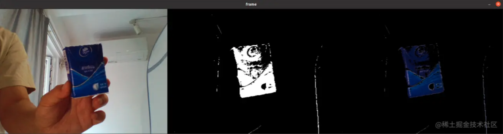
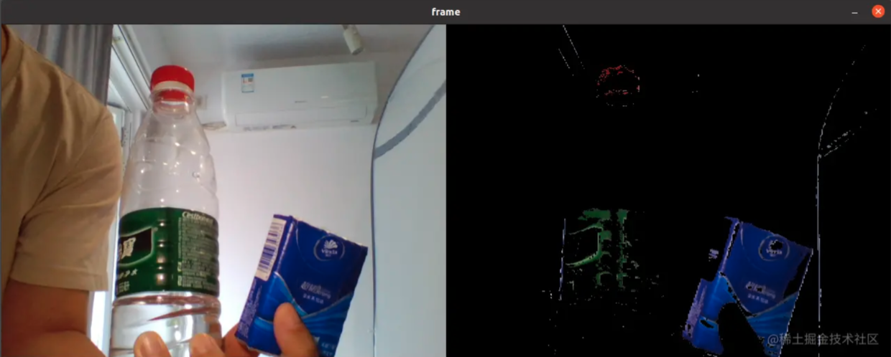

本文主要内容来自于 [OpenCV-Python 教程](https://docs.opencv.org/4.5.5/d6/d00/tutorial_py_root.html) 的 [OpenCV 中的图像处理](https://docs.opencv.org/4.5.5/d2/d96/tutorial_py_table_of_contents_imgproc.html) 部分，这个部分的主要内容如下：

-   [改变色彩空间](https://docs.opencv.org/4.5.5/df/d9d/tutorial_py_colorspaces.html)

    学习在不同色彩空间之间改变图像。另外学习跟踪视频中的彩色对象。

-   [图像的几何变换](https://docs.opencv.org/4.5.5/da/d6e/tutorial_py_geometric_transformations.html)

    学习对图像应用不同的几何变换，比如旋转、平移等。

-   [图像阈值](https://docs.opencv.org/4.5.5/d7/d4d/tutorial_py_thresholding.html)

    学习使用全局阈值、自适应阈值、Otsu 的二值化等将图像转换为二值图像。

-   [平滑图像](https://docs.opencv.org/4.5.5/d4/d13/tutorial_py_filtering.html)

    学习模糊图像，使用自定义内核过滤图像等。

-   [形态变换](https://docs.opencv.org/4.5.5/d9/d61/tutorial_py_morphological_ops.html)

    了解形态学变换，如侵蚀、膨胀、开放、闭合等。

-   [图像渐变](https://docs.opencv.org/4.5.5/d5/d0f/tutorial_py_gradients.html)

    学习寻找图像渐变、边缘等。

-   [Canny 边缘检测](https://docs.opencv.org/4.5.5/da/d22/tutorial_py_canny.html)

    学习通过 Canny 边缘检测寻找边缘。

-   [图像金字塔](https://docs.opencv.org/4.5.5/dc/dff/tutorial_py_pyramids.html)

    学习关于图像金字塔的内容，以及如何使用它们进行图像混合。

-   [OpenCV 中的轮廓](https://docs.opencv.org/4.5.5/d3/d05/tutorial_py_table_of_contents_contours.html)

    所有关于 OpenCV 中的轮廓的内容。

-   [OpenCV 中的直方图](https://docs.opencv.org/4.5.5/de/db2/tutorial_py_table_of_contents_histograms.html)

    所有关于 OpenCV 中的直方图的内容。

-   [OpenCV 中的图像变换](https://docs.opencv.org/4.5.5/dd/dc4/tutorial_py_table_of_contents_transforms.html)

    在 OpenCV 中遇到不同的图像变换，如傅里叶变换、余弦变换等。

-   [模板匹配](https://docs.opencv.org/4.5.5/d4/dc6/tutorial_py_template_matching.html)

    学习使用模板匹配在图像中搜索对象。

-   [霍夫线变换](https://docs.opencv.org/4.5.5/d6/d10/tutorial_py_houghlines.html)

    学习在一幅图像中探测线。

-   [霍夫圆变换](https://docs.opencv.org/4.5.5/da/d53/tutorial_py_houghcircles.html)

    学习在一幅图像中探测圆。

-   [使用分水岭算法的图像分割](https://docs.opencv.org/4.5.5/d3/db4/tutorial_py_watershed.html)

    学习使用分水岭分割算法分割图像。

-   [使用 GrabCut 算法的交互式前景提取](https://docs.opencv.org/4.5.5/d8/d83/tutorial_py_grabcut.html)

    学习使用 GrabCut 算法提取前景

这一部分无疑是 OpenCV 提供的核心能力的一部分了。

## 目标

 * 在这份教程中，我们将学习如何将图像从一个色彩空间转换到另一个。比如 BGR -> Gray，BGR -> HSV，等等。
 * 此外，我们将创建一个应用程序，从视频中提取彩色的物品。
 * 我们将学习如下的函数：**[cv.cvtColor()](https://docs.opencv.org/4.5.5/d8/d01/group__imgproc__color__conversions.html#ga397ae87e1288a81d2363b61574eb8cab "Converts an image from one color space to another. ")**，**[cv.inRange()](https://docs.opencv.org/4.5.5/d2/de8/group__core__array.html#ga48af0ab51e36436c5d04340e036ce981 "Checks if array elements lie between the elements of two other arrays. ")** 等等。

## 改变色彩空间

在 OpenCV 中有超过 150 个色彩空间转换方法可用。但我们只会深入了解其中的两个，它们是最常用的：BGR -> Gray 和 BGR -> HSV。

对于色彩转换，我们使用函数 `cv.cvtColor(input_image, flag)`，其中的 *flag* 参数决定了转换的类型。

对于 BGR -> Gray 转换，我们使用 *flag* **[cv.COLOR_BGR2GRAY](https://docs.opencv.org/4.5.5/d8/d01/group__imgproc__color__conversions.html#gga4e0972be5de079fed4e3a10e24ef5ef0a353a4b8db9040165db4dacb5bcefb6ea "convert between RGB/BGR and grayscale, color conversions ")**。类似地，对于 BGR -> HSV，我们使用 *flag* **[cv.COLOR_BGR2HSV](https://docs.opencv.org/4.5.5/d8/d01/group__imgproc__color__conversions.html#gga4e0972be5de079fed4e3a10e24ef5ef0aa4a7f0ecf2e94150699e48c79139ee12 "convert RGB/BGR to HSV (hue saturation value) with H range 0..180 if 8 bit image, color conversions ...")**。要获得其它的 *flags*，可以执行如下这段代码：
```
import cv2 as cv

def color_space():
    flags = [name for name in dir(cv) if name.startswith("COLOR_")]
    print("There is ", len(flags), " flags")
    flags = "\n".join(flags)
    print(flags)
```

OpenCV 4.5.4 版环境中执行这段代码，输出如下：
```
There is  346  flags
COLOR_BAYER_BG2BGR
COLOR_BAYER_BG2BGRA
COLOR_BAYER_BG2BGR_EA
. . . . . .
```

即可以执行的色彩空间转换多达  346 种。

 > 注意
 > 对于 HSV，色调 (hue) 的范围为 [0,179]，饱和度 (saturation) 的范围为 [0,255]，明度 (value) 范围为 [0,255]。不同的软件使用不同的尺度。因此，如果需要将 OpenCV 值与它们进行比较，则需要对这些范围进行归一化。

## 对象追踪

现在我们知道如何将一幅 BGR 图像转换到 HSV 了，我们可以使用这种操作提取一个彩色的物体。在 HSV 中，表示彩色物体比在 BGR 色彩空间中更容易。在我们的应用程序中，我们将尝试提取蓝色物体。这是具体的方法：

 * 获取视频的每一帧
 * 将图像从 BGR 转换到 HSV 色彩空间
 * 我们将 HSV 图像阈值设置为蓝色范围
 * 现在单独提取蓝色物体，我们可以在该图像上做任何我们想做的事情。

下面是详细注释的代码：
```
def object_tracking():
    cap = cv.VideoCapture(0)

    while True:
        # Take each frame
        _, frame = cap.read()

        # Convert BGR to HSV
        hsv = cv.cvtColor(frame, cv.COLOR_BGR2HSV)

        # define range of blue color in HSV
        lower_blue = np.array([110, 50, 50])
        upper_blue = np.array([130, 255, 255])

        # Threshold the HSV image to get only blue colors
        mask = cv.inRange(hsv, lower_blue, upper_blue)

        # Bitwise-AND mask and original image
        res = cv.bitwise_and(frame, frame, mask=mask)

        mask = cv.merge((mask, mask, mask))

        # print(frame.shape, mask.shape, res.shape)
        dest = cv.hconcat([frame, mask, res])
        cv.imshow('frame', dest)

        k = cv.waitKey(5) & 0xFF
        if k == 27:
            break

    cv.destroyAllWindows()
```

下图展示了蓝色物体的追踪：



 > 注意
 > 图像中有一些噪声。我们将在后面的章节中了解如何移除它。
 > 这是对象追踪中最简单的方法。一旦我们学习了轮廓相关的函数，我们就可以做很多事情，比如找到物体的质心并用它来跟踪物体，只需在相机前移动我们的手指就可以绘制图表，以及其它有趣的事情。

如何找到要追踪的 HSV 值

这是 [stackoverflow.com](https://www.stackoverflow.com/) 中的一个常见问题。它非常简单，我们可以使用相同的函数，**[cv.cvtColor()](https://docs.opencv.org/4.5.5/d8/d01/group__imgproc__color__conversions.html#ga397ae87e1288a81d2363b61574eb8cab "Converts an image from one color space to another. ")**。不是传入一幅图像，而是仅仅传入我们需要的 BGR 值。比如，要找到蓝色、绿色和红色的 HSV 值，可以通过如下这段代码实现：
```
def bgr_color_in_hsv():
    arr = np.zeros((1, 3, 3), np.uint8)
    arr[0][0] = (255, 0, 0)
    arr[0][1] = (0, 255, 0)
    arr[0][2] = (0, 0, 255)
    hsv = cv.cvtColor(arr, cv.COLOR_BGR2HSV)
    print("Blue HSV: ", hsv[0][0])
    print("Green HSV: ", hsv[0][1])
    print("Red HSV: ", hsv[0][2])
```

上面这段代码的输出如下：
```
Blue HSV:  [120 255 255]
Green HSV:  [ 60 255 255]
Red HSV:  [  0 255 255]
```

要探测蓝色之外的其它颜色的物体，只需要将上面那段代码中，`cv.inRange(hsv, lower_blue, upper_blue)` 的参数修改为目标颜色的范围即可。比如将 [H-10, 100,100] 和 [H+10, 255, 255] 分别作为下限和上限，可以追踪红色物体。除了这种方法，还可以使用任何图像编辑工具，如 GIMP 或任何在线转换器来查找这些值，但不要忘记调整 HSV 范围。

## 其它资源

## 练习

1. 尝试找到一种方法来提取多个彩色对象，例如同时提取红色、蓝色和绿色对象。

这里给出一个参考实现。这段代码分别将各个颜色的物体提取出来，然后再将各个物体的图像相加，得到最终需要的图像：
```
def multi_objects_tracking():
    cap = cv.VideoCapture(0)

    while True:
        # Take each frame
        _, frame = cap.read()

        # Convert BGR to HSV
        hsv = cv.cvtColor(frame, cv.COLOR_BGR2HSV)

        # define range of blue color in HSV
        lower_blue = np.array([110, 50, 50])
        upper_blue = np.array([130, 255, 255])

        # Threshold the HSV image to get only blue colors
        mask_blue = cv.inRange(hsv, lower_blue, upper_blue)

        # Bitwise-AND mask and original image
        blue_res = cv.bitwise_and(frame, frame, mask=mask_blue)

        # define range of green color in HSV
        lower_green = np.array([50, 50, 50])
        upper_green = np.array([70, 255, 255])

        # Threshold the HSV image to get only blue colors
        mask_green = cv.inRange(hsv, lower_green, upper_green)

        # Bitwise-AND mask and original image
        green_res = cv.bitwise_and(frame, frame, mask=mask_green)

        # define range of red color in HSV
        lower_red = np.array([0, 50, 50])
        upper_red  = np.array([0, 255, 255])

        # Threshold the HSV image to get only blue colors
        mask_red = cv.inRange(hsv, lower_red, upper_red)

        # Bitwise-AND mask and original image
        red_res = cv.bitwise_and(frame, frame, mask=mask_red)

        res = cv.add(blue_res, green_res)
        res = cv.add(res, red_res)

        dest = cv.hconcat([frame, res])
        cv.imshow('frame', dest)

        k = cv.waitKey(5) & 0xFF
        if k == 27:
            break

    cv.destroyAllWindows()
```

结果将类似于下面这样：



**参考文档**

[Changing Colorspaces](https://docs.opencv.org/4.5.5/df/d9d/tutorial_py_colorspaces.html)

Done.
