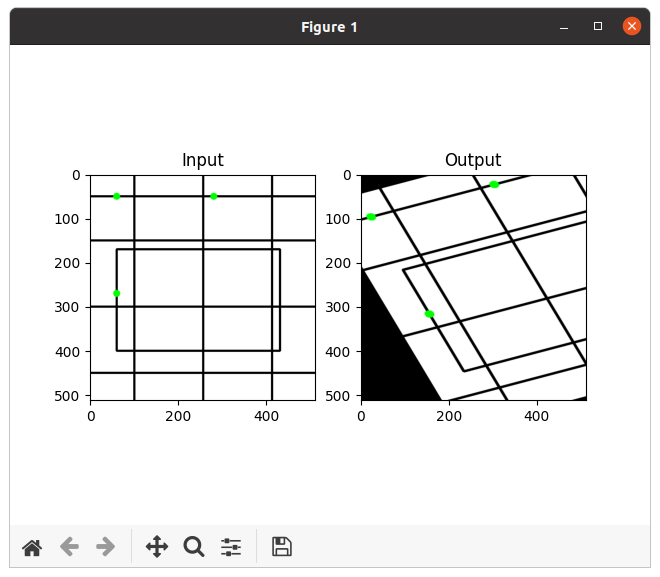
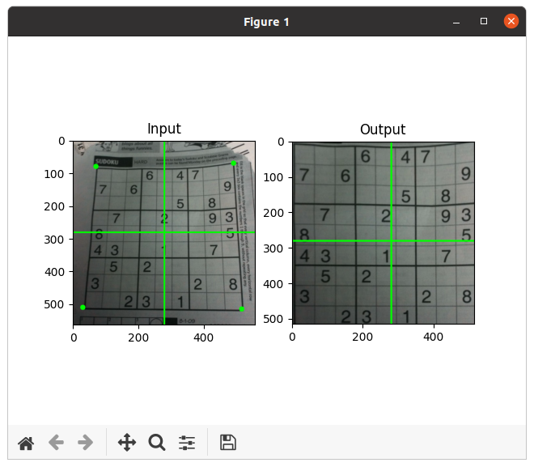

本文主要内容来自于 [OpenCV-Python 教程](https://docs.opencv.org/4.5.5/d6/d00/tutorial_py_root.html) 的 [OpenCV 中的图像处理](https://docs.opencv.org/4.5.5/d2/d96/tutorial_py_table_of_contents_imgproc.html) 部分，这个部分的主要内容如下：
<!--more-->
-   [改变色彩空间](https://docs.opencv.org/4.5.5/df/d9d/tutorial_py_colorspaces.html)

    学习在不同色彩空间之间改变图像。另外学习跟踪视频中的彩色对象。

-   [图像的几何变换](https://docs.opencv.org/4.5.5/da/d6e/tutorial_py_geometric_transformations.html)

    学习对图像应用不同的几何变换，比如旋转、平移等。

-   [图像阈值](https://docs.opencv.org/4.5.5/d7/d4d/tutorial_py_thresholding.html)

    学习使用全局阈值、自适应阈值、Otsu 的二值化等将图像转换为二值图像。

-   [平滑图像](https://docs.opencv.org/4.5.5/d4/d13/tutorial_py_filtering.html)

    学习模糊图像，使用自定义内核过滤图像等。

-   [形态变换](https://docs.opencv.org/4.5.5/d9/d61/tutorial_py_morphological_ops.html)

    了解形态学变换，如侵蚀、膨胀、开放、闭合等。

-   [图像渐变](https://docs.opencv.org/4.5.5/d5/d0f/tutorial_py_gradients.html)

    学习寻找图像渐变、边缘等。

-   [Canny 边缘检测](https://docs.opencv.org/4.5.5/da/d22/tutorial_py_canny.html)

    学习通过 Canny 边缘检测寻找边缘。

-   [图像金字塔](https://docs.opencv.org/4.5.5/dc/dff/tutorial_py_pyramids.html)

    学习关于图像金字塔的内容，以及如何使用它们进行图像混合。

-   [OpenCV 中的轮廓](https://docs.opencv.org/4.5.5/d3/d05/tutorial_py_table_of_contents_contours.html)

    所有关于 OpenCV 中的轮廓的内容。

-   [OpenCV 中的直方图](https://docs.opencv.org/4.5.5/de/db2/tutorial_py_table_of_contents_histograms.html)

    所有关于 OpenCV 中的直方图的内容。

-   [OpenCV 中的图像变换](https://docs.opencv.org/4.5.5/dd/dc4/tutorial_py_table_of_contents_transforms.html)

    在 OpenCV 中遇到不同的图像变换，如傅里叶变换、余弦变换等。

-   [模板匹配](https://docs.opencv.org/4.5.5/d4/dc6/tutorial_py_template_matching.html)

    学习使用模板匹配在图像中搜索对象。

-   [霍夫线变换](https://docs.opencv.org/4.5.5/d6/d10/tutorial_py_houghlines.html)

    学习在一幅图像中探测线。

-   [霍夫圆变换](https://docs.opencv.org/4.5.5/da/d53/tutorial_py_houghcircles.html)

    学习在一幅图像中探测圆。

-   [使用分水岭算法的图像分割](https://docs.opencv.org/4.5.5/d3/db4/tutorial_py_watershed.html)

    学习使用分水岭分割算法分割图像。

-   [使用 GrabCut 算法的交互式前景提取](https://docs.opencv.org/4.5.5/d8/d83/tutorial_py_grabcut.html)

    学习使用 GrabCut 算法提取前景

## 目标

 * 学习对图像应用不同的几何变换，比如平移，旋转和仿射变换等等。
 * 我们将看到这些函数：**[cv.getPerspectiveTransform](https://docs.opencv.org/4.5.5/da/d54/group__imgproc__transform.html#ga20f62aa3235d869c9956436c870893ae "Calculates a perspective transform from four pairs of the corresponding points. ")**。

## 变换

OpenCV 提供了两个变换函数，**[cv.warpAffine](https://docs.opencv.org/4.5.5/da/d54/group__imgproc__transform.html#ga0203d9ee5fcd28d40dbc4a1ea4451983 "Applies an affine transformation to an image. ")** 和 **[cv.warpPerspective](https://docs.opencv.org/4.5.5/da/d54/group__imgproc__transform.html#gaf73673a7e8e18ec6963e3774e6a94b87 "Applies a perspective transformation to an image. ")**，通过它们我们可以执行所有种类的变换。**[cv.warpAffine](https://docs.opencv.org/4.5.5/da/d54/group__imgproc__transform.html#ga0203d9ee5fcd28d40dbc4a1ea4451983 "Applies an affine transformation to an image. ")** 接收一个 2x3 的变换矩阵，而 **[cv.warpPerspective](https://docs.opencv.org/4.5.5/da/d54/group__imgproc__transform.html#gaf73673a7e8e18ec6963e3774e6a94b87 "Applies a perspective transformation to an image. ")** 则接收一个 3x3 的变换矩阵作为参数。

### 放缩

放缩只是改变图像的大小。OpenCV 有一个函数 **[cv.resize()](https://docs.opencv.org/4.5.5/da/d54/group__imgproc__transform.html#ga47a974309e9102f5f08231edc7e7529d "Resizes an image. ")** 用于完成这个操作。图像的大小可以手动指定，或者可以指定放缩因子。放缩时可以使用不同的插值方法。用于缩小的首选插值方法是 **[cv.INTER_AREA](https://docs.opencv.org/4.5.5/da/d54/group__imgproc__transform.html#gga5bb5a1fea74ea38e1a5445ca803ff121acf959dca2480cc694ca016b81b442ceb)**，用于放大的是  **[cv.INTER_CUBIC](https://docs.opencv.org/4.5.5/da/d54/group__imgproc__transform.html#gga5bb5a1fea74ea38e1a5445ca803ff121a55e404e7fa9684af79fe9827f36a5dc1)** (slow) & **[cv.INTER_LINEAR](https://docs.opencv.org/4.5.5/da/d54/group__imgproc__transform.html#gga5bb5a1fea74ea38e1a5445ca803ff121ac97d8e4880d8b5d509e96825c7522deb)**。默认情况下，**[cv.INTER_LINEAR](https://docs.opencv.org/4.5.5/da/d54/group__imgproc__transform.html#gga5bb5a1fea74ea38e1a5445ca803ff121ac97d8e4880d8b5d509e96825c7522deb)** 插值方法用于所有的调整大小。我们可以通过如下的方法改变一幅输入图像的大小：
```
def scaling():
    cv.samples.addSamplesDataSearchPath("/media/data/my_multimedia/opencv-4.x/samples/data")
    img = cv.imread(cv.samples.findFile('messi5.jpg'))
    res = cv.resize(img, None, fx=2, fy=2, interpolation=cv.INTER_CUBIC)
    cv.imshow('frame', res)

    # OR
    height, width = img.shape[:2]
    res = cv.resize(img, (2 * width, 2 * height), interpolation=cv.INTER_CUBIC)
    cv.waitKey()

    cv.destroyAllWindows()
```

放缩操作对许多以多幅图像为参数的操作比较有意义。当某个操作的输入为多幅图像，且对输入的图像的大小有一定的限制，而实际的输入图像又难以满足这种限制时，放缩可以帮我们改变部分图像的大小，以满足目标操作的输入要求。比如多幅图像的相加操作，图像的水平拼接和竖直拼接等。

## 平移

平移是移动一个物体的位置。如果知道了 (x,y) 方向的偏移，并使其为 ($t_x$,$t_y$)，则我们可以创建如下的转换矩阵：
$$
\begin{bmatrix}
1&0&t_x \\
0&1&t_x
\end{bmatrix}
$$

$$
dst(x,y) = src(M_{11} ∗ x+M_{12}∗ y+M_{13}, M_{21}∗ x+M_{22}∗ y+M_{23}) \\
= src(1∗x+0∗y+t_x, 0∗x+1∗y+t_y)
$$

我们可以把它放入 np.float32 类型的 Numpy 数组并将其传递给 **[cv.warpAffine()](https://docs.opencv.org/4.5.5/da/d54/group__imgproc__transform.html#ga0203d9ee5fcd28d40dbc4a1ea4451983 "Applies an affine transformation to an image. ")** 函数。可以参考下面移动 (100,50) 的例子：
```
def translation():
    cv.samples.addSamplesDataSearchPath("/media/data/my_multimedia/opencv-4.x/samples/data")
    img = cv.imread(cv.samples.findFile('messi5.jpg'))

    rows, cols, _ = img.shape
    M = np.float32([[1, 0, 100], [0, 1, 50]])
    dst = cv.warpAffine(img, M, (cols, rows))
    
    dst = cv.hconcat([img, dst])

    cv.imshow('frame', dst)
    cv.waitKey()

    cv.destroyAllWindows()
```

**[cv.warpAffine()](https://docs.opencv.org/4.5.5/da/d54/group__imgproc__transform.html#ga0203d9ee5fcd28d40dbc4a1ea4451983 "Applies an affine transformation to an image. ")** 函数的第三个参数是输出图像的大小，它的形式应该是 **(width, height)**。记得 width = 列数，而 height = 行数。

看到的结果应该像下面这样：


### 旋转

将一幅图像旋转角度 θ，可以通过如下的转换矩阵实现：
$$ M =
\begin{bmatrix}
cosθ&−sinθ \\
sinθ&cosθ
\end{bmatrix}
$$

但是 OpenCV 提供了带有可调节旋转中心的放缩旋转，因此我们可以在任何喜欢的位置旋转。修改后的变换矩阵由下式给出

$$
\begin{bmatrix}
α&β&(1−α)⋅center.x−β⋅center.y \\
−β&α&β⋅center.x+(1−α)⋅center.y
\end{bmatrix}
$$

其中：
$$
α=scale⋅cosθ, \\
β=scale⋅sinθ
$$

为了获得这个旋转矩阵，OpenCV 提供了一个函数，**[cv.getRotationMatrix2D](https://docs.opencv.org/4.5.5/da/d54/group__imgproc__transform.html#gafbbc470ce83812914a70abfb604f4326 "Calculates an affine matrix of 2D rotation. ")**。检查如下的例子，它将图像相对于中心旋转 120 度且放大到 1.2 倍。
```
def rotation():
    cv.samples.addSamplesDataSearchPath("/media/data/my_multimedia/opencv-4.x/samples/data")
    img = cv.imread(cv.samples.findFile('messi5.jpg'))

    rows, cols, _ = img.shape

    # cols-1 and rows-1 are the coordinate limits.
    M = cv.getRotationMatrix2D(((cols - 1) / 2.0, (rows - 1) / 2.0), 120, 1.2)
    dst = cv.warpAffine(img, M, (cols, rows))

    dst = cv.hconcat([img, dst])
    cv.imshow('frame', dst)
    cv.waitKey()

    cv.destroyAllWindows()
```

来看下结果：


### 放射变换

在仿射变换中，原始图像中所有的平行线在输出的图像中依然是平行的。为了找到变换矩阵，我们需要输入图像中的三个点，以及它们在输出图像中对应的位置。**[cv.getAffineTransform](https://docs.opencv.org/4.5.5/da/d54/group__imgproc__transform.html#ga8f6d378f9f8eebb5cb55cd3ae295a999 "Calculates an affine transform from three pairs of the corresponding points. ")** 将创建一个 2x3 的矩阵，它将被传给 **[cv.warpAffine](https://docs.opencv.org/4.5.5/da/d54/group__imgproc__transform.html#ga0203d9ee5fcd28d40dbc4a1ea4451983 "Applies an affine transformation to an image. ")**。

检查下面的例子，我们也将看到选中的点（它们用绿色标记）：
```
def affine_transformation():
    img = np.zeros((512, 512, 3), np.uint8)
    cv.rectangle(img, (0, 0), (512, 512), (255, 255, 255), -1)

    cv.line(img, (0, 50), (512, 50), (0, 0, 0), 3)
    cv.line(img, (0, 150), (512, 150), (0, 0, 0), 3)
    cv.line(img, (0, 300), (512, 300), (0, 0, 0), 3)
    cv.line(img, (0, 450), (512, 450), (0, 0, 0), 3)

    cv.line(img, (100, 0), (100, 512), (0, 0, 0), 3)
    cv.line(img, (256, 0), (256, 512), (0, 0, 0), 3)
    cv.line(img, (412, 0), (412, 512), (0, 0, 0), 3)

    cv.rectangle(img, (60, 170), (430, 400), (0, 0, 0), 3)

    # img, center, radius, color, thickness=None
    cv.circle(img, (60, 50), 8, (0, 255, 0), -1)
    cv.circle(img, (280, 50), 8, (0, 255, 0), -1)
    cv.circle(img, (60, 270), 8, (0, 255, 0), -1)

    rows, cols, ch = img.shape

    pts1 = np.float32([[50, 50], [200, 50], [50, 200]])
    pts2 = np.float32([[10, 100], [200, 50], [100, 250]])

    M = cv.getAffineTransform(pts1, pts2)

    dst = cv.warpAffine(img, M, (cols, rows))

    plt.subplot(121), plt.imshow(img), plt.title('Input')
    plt.subplot(122), plt.imshow(dst), plt.title('Output')
    plt.show()


if __name__ == "__main__":
    affine_transformation()
```

可以看到下面的结果：



### 透视变换

对于透视变换，我们需要一个 3x3 的变换矩阵。即使在转换之后，直线也将保持笔直。要找到这个变换矩阵，我们需要输入图像上的 4 个点和输出图像上的对应点。这 4 个点中，有 3 个不应该共线。然后可以通过函数 **[cv.getPerspectiveTransform](https://docs.opencv.org/4.5.5/da/d54/group__imgproc__transform.html#ga20f62aa3235d869c9956436c870893ae "Calculates a perspective transform from four pairs of the corresponding points. ")** 找到变换矩阵。然后用这个 3x3 变换矩阵应用 **[cv.warpPerspective](https://docs.opencv.org/4.5.5/da/d54/group__imgproc__transform.html#gaf73673a7e8e18ec6963e3774e6a94b87 "Applies a perspective transformation to an image. ")**。

可以看下如下的代码：
```
def perspective_transformation():
    cv.samples.addSamplesDataSearchPath("/media/data/my_multimedia/opencv-4.x/samples/data")
    img = cv.imread(cv.samples.findFile('sudoku.png'))
    rows, cols, ch = img.shape

    pts1 = np.float32([[70, 80], [490, 70], [30, 510], [515, 515]])
    pts2 = np.float32([[0, 0], [515, 0], [0, 515], [515, 515]])
    M = cv.getPerspectiveTransform(pts1, pts2)
    dst = cv.warpPerspective(img, M, (515, 515))

    cv.line(img, (0, int(rows / 2)), (cols, int(rows / 2)), (0, 255, 0), 3)
    cv.line(img, (int(cols / 2), 0), (int(cols / 2), rows), (0, 255, 0), 3)

    cv.circle(img, (70, 80), 8, (0, 255, 0), -1)
    cv.circle(img, (490, 70), 8, (0, 255, 0), -1)
    cv.circle(img, (30, 510), 8, (0, 255, 0), -1)
    cv.circle(img, (515, 515), 8, (0, 255, 0), -1)

    plt.subplot(121), plt.imshow(img), plt.title('Input')

    cv.line(dst, (0, int(rows / 2)), (cols, int(rows / 2)), (0, 255, 0), 3)
    cv.line(dst, (int(cols / 2), 0), (int(cols / 2), rows), (0, 255, 0), 3)
    plt.subplot(122), plt.imshow(dst), plt.title('Output')
    plt.show()


if __name__ == "__main__":
    perspective_transformation()
```

最终的结果如下图：



## 其它资源

1. "Computer Vision: Algorithms and Applications", Richard Szeliski

**参考文档**

[Geometric Transformations of Images](https://docs.opencv.org/4.5.5/da/d6e/tutorial_py_geometric_transformations.html)

[Markdown 中的常用 LaTex 数学公式](https://zhuanlan.zhihu.com/p/95886235)

[Markdown数学公式语法](https://www.jianshu.com/p/e74eb43960a1)

[Cmd Markdown 公式指导手册](https://www.zybuluo.com/codeep/note/163962)

Done.
