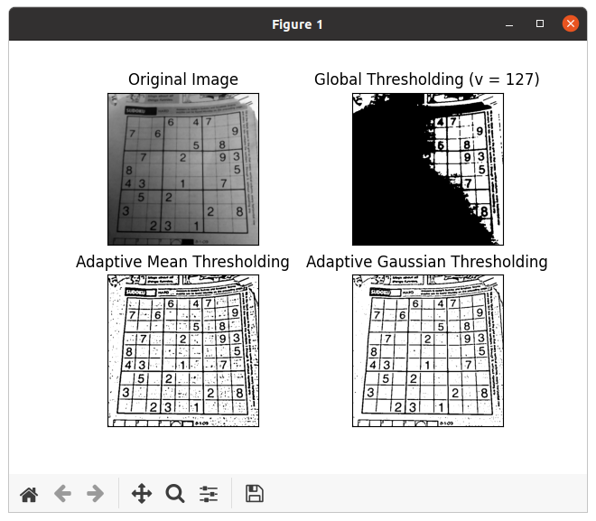
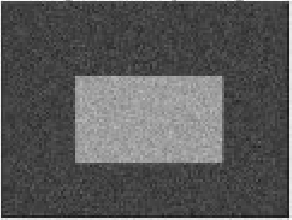
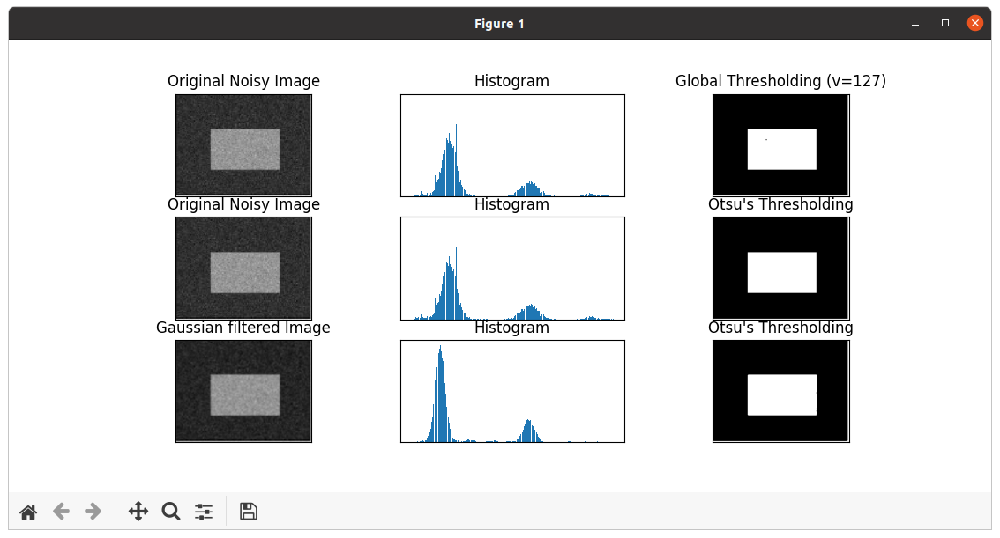

本文主要内容来自于 [OpenCV-Python 教程](https://docs.opencv.org/4.5.5/d6/d00/tutorial_py_root.html) 的 [OpenCV 中的图像处理](https://docs.opencv.org/4.5.5/d2/d96/tutorial_py_table_of_contents_imgproc.html) 部分，这部分的全部主要内容如下：
<!--more-->
-   [改变色彩空间](https://docs.opencv.org/4.5.5/df/d9d/tutorial_py_colorspaces.html)

    学习在不同色彩空间之间改变图像。另外学习跟踪视频中的彩色对象。

-   [图像的几何变换](https://docs.opencv.org/4.5.5/da/d6e/tutorial_py_geometric_transformations.html)

    学习对图像应用不同的几何变换，比如旋转、平移等。

-   [图像阈值](https://docs.opencv.org/4.5.5/d7/d4d/tutorial_py_thresholding.html)

    学习使用全局阈值、自适应阈值、Otsu 的二值化等将图像转换为二值图像。

-   [平滑图像](https://docs.opencv.org/4.5.5/d4/d13/tutorial_py_filtering.html)

    学习模糊图像，使用自定义内核过滤图像等。

-   [形态变换](https://docs.opencv.org/4.5.5/d9/d61/tutorial_py_morphological_ops.html)

    了解形态学变换，如侵蚀、膨胀、开放、闭合等。

-   [图像渐变](https://docs.opencv.org/4.5.5/d5/d0f/tutorial_py_gradients.html)

    学习寻找图像渐变、边缘等。

-   [Canny 边缘检测](https://docs.opencv.org/4.5.5/da/d22/tutorial_py_canny.html)

    学习通过 Canny 边缘检测寻找边缘。

-   [图像金字塔](https://docs.opencv.org/4.5.5/dc/dff/tutorial_py_pyramids.html)

    学习关于图像金字塔的内容，以及如何使用它们进行图像混合。

-   [OpenCV 中的轮廓](https://docs.opencv.org/4.5.5/d3/d05/tutorial_py_table_of_contents_contours.html)

    所有关于 OpenCV 中的轮廓的内容。

-   [OpenCV 中的直方图](https://docs.opencv.org/4.5.5/de/db2/tutorial_py_table_of_contents_histograms.html)

    所有关于 OpenCV 中的直方图的内容。

-   [OpenCV 中的图像变换](https://docs.opencv.org/4.5.5/dd/dc4/tutorial_py_table_of_contents_transforms.html)

    在 OpenCV 中遇到不同的图像变换，如傅里叶变换、余弦变换等。

-   [模板匹配](https://docs.opencv.org/4.5.5/d4/dc6/tutorial_py_template_matching.html)

    学习使用模板匹配在图像中搜索对象。

-   [霍夫线变换](https://docs.opencv.org/4.5.5/d6/d10/tutorial_py_houghlines.html)

    学习在一幅图像中探测线。

-   [霍夫圆变换](https://docs.opencv.org/4.5.5/da/d53/tutorial_py_houghcircles.html)

    学习在一幅图像中探测圆。

-   [使用分水岭算法的图像分割](https://docs.opencv.org/4.5.5/d3/db4/tutorial_py_watershed.html)

    学习使用分水岭分割算法分割图像。

-   [使用 GrabCut 算法的交互式前景提取](https://docs.opencv.org/4.5.5/d8/d83/tutorial_py_grabcut.html)

    学习使用 GrabCut 算法提取前景

## 目标

 * 在这份教程中，我们将学习简单阈值、自适应阈值和 Otsu 阈值。
 * 我们将学习 **[cv.threshold](https://docs.opencv.org/4.5.5/d7/d1b/group__imgproc__misc.html#gae8a4a146d1ca78c626a53577199e9c57 "Applies a fixed-level threshold to each array element. ")** 和 **[cv.adaptiveThreshold](https://docs.opencv.org/4.5.5/d7/d1b/group__imgproc__misc.html#ga72b913f352e4a1b1b397736707afcde3 "Applies an adaptive threshold to an array. ")** 函数。

## 简单阈值

在这里，事情是直截了当的。对于每个像素，应用相同的阈值。如果像素值比阈值小，则设置为 0，否则设置为最大值。函数 **[cv.threshold](https://docs.opencv.org/4.5.5/d7/d1b/group__imgproc__misc.html#gae8a4a146d1ca78c626a53577199e9c57 "Applies a fixed-level threshold to each array element. ")** 用于应用阈值。第一个参数是源图像，它 **应该是一幅灰度图**。第二个参数是用于分类像素值的阈值。第三个参数是分配给超出阈值的像素值的最大值。OpenCV 提供了不同类型的阈值，它们由函数的第四个参数给出。如上所述的基本阈值处理是通过使用类型 [cv.THRESH_BINARY](https://docs.opencv.org/4.5.5/d7/d1b/group__imgproc__misc.html#ggaa9e58d2860d4afa658ef70a9b1115576a147222a96556ebc1d948b372bcd7ac59 " ") 完成的。所有的简单阈值类型如下：

*   **[cv.THRESH_BINARY](https://docs.opencv.org/4.5.5/d7/d1b/group__imgproc__misc.html#ggaa9e58d2860d4afa658ef70a9b1115576a147222a96556ebc1d948b372bcd7ac59 " ")**
*   **[cv.THRESH_BINARY_INV](https://docs.opencv.org/4.5.5/d7/d1b/group__imgproc__misc.html#ggaa9e58d2860d4afa658ef70a9b1115576a19120b1a11d8067576cc24f4d2f03754 " ")**
*   **[cv.THRESH_TRUNC](https://docs.opencv.org/4.5.5/d7/d1b/group__imgproc__misc.html#ggaa9e58d2860d4afa658ef70a9b1115576ac7e89a5e95490116e7d2082b3096b2b8 " ")**
*   **[cv.THRESH_TOZERO](https://docs.opencv.org/4.5.5/d7/d1b/group__imgproc__misc.html#ggaa9e58d2860d4afa658ef70a9b1115576a0e50a338a4b711a8c48f06a6b105dd98 " ")**
*   **[cv.THRESH_TOZERO_INV](https://docs.opencv.org/4.5.5/d7/d1b/group__imgproc__misc.html#ggaa9e58d2860d4afa658ef70a9b1115576a47518a30aae90d799035bdcf0bb39a50 " ")**

参考这些类型的文档来了解它们之间的差异。

这些方法放回两个输出。第一个是使用的阈值，第二个输出是 **阈值图像**。

如下这段代码比较了不同的简单阈值类型：
```
import cv2 as cv
import numpy as np
from matplotlib import pyplot as plt

def simple_thresholding():
    cv.samples.addSamplesDataSearchPath("/media/data/my_multimedia/opencv-4.x/samples/data")
    img = cv.imread(cv.samples.findFile('gradient.png'), 0)
    # img = cv.imread('gradient.png', 0)
    ret, thresh1 = cv.threshold(img, 127, 255, cv.THRESH_BINARY)
    ret, thresh2 = cv.threshold(img, 127, 255, cv.THRESH_BINARY_INV)
    ret, thresh3 = cv.threshold(img, 127, 255, cv.THRESH_TRUNC)
    ret, thresh4 = cv.threshold(img, 127, 255, cv.THRESH_TOZERO)
    ret, thresh5 = cv.threshold(img, 127, 255, cv.THRESH_TOZERO_INV)

    titles = ['Original Image', 'BINARY', 'BINARY_INV', 'TRUNC', 'TOZERO', 'TOZERO_INV']
    images = [img, thresh1, thresh2, thresh3, thresh4, thresh5]

    for i in range(6):
        plt.subplot(2, 3, i + 1), plt.imshow(images[i], 'gray', vmin=0, vmax=255)
        plt.title(titles[i])
        plt.xticks([]), plt.yticks([])
    plt.show()


if __name__ == "__main__":
    simple_thresholding()
```

 > **注意**
 > 为了 plot 多幅图像，我们使用了 *plt.subplot()* 函数。请参考 matplotlib 的文档来了解更多细节。


上面这段代码生成的结果如下：


## 自适应阈值

在前一节中，我们使用一个全局值作为阈值。但这可能并不适用于所有情况，例如，如果图像在不同区域具有不同的照明条件。在这种情况下，自适应阈值可以提供帮助。在这里，该算法根据像素周围的小片区域确定像素的阈值。因此，我们为同一图像的不同区域获得了不同的阈值，这对于具有不同照明的图像提供了更好的结果。

除了上面描述的参数，**[cv.adaptiveThreshold](https://docs.opencv.org/4.5.5/d7/d1b/group__imgproc__misc.html#ga72b913f352e4a1b1b397736707afcde3 "Applies an adaptive threshold to an array. ")** 方法接收三个输入参数：

**adaptiveMethod** 决定了如何计算阈值：

 * **[cv.ADAPTIVE_THRESH_MEAN_C](https://docs.opencv.org/4.5.5/d7/d1b/group__imgproc__misc.html#ggaa42a3e6ef26247da787bf34030ed772cad0c5199ae8637a6b195062fea4789fa9)**：阈值是邻域面积的平均值减去常数 C。
 * **[cv.ADAPTIVE_THRESH_GAUSSIAN_C](https://docs.opencv.org/4.5.5/d7/d1b/group__imgproc__misc.html#ggaa42a3e6ef26247da787bf34030ed772caf262a01e7a3f112bbab4e8d8e28182dd)**：阈值是邻域值减去常数 C 的高斯加权和。

**blockSize** 决定了邻域的大小，**C** 是从邻域像素的平均值或加权和中减去的常数。

下面的代码比较了具有不同照明的图像的全局阈值和自适应阈值：
```
import cv2 as cv
import numpy as np
from matplotlib import pyplot as plt

def adaptive_thresholding():
    cv.samples.addSamplesDataSearchPath("/media/data/my_multimedia/opencv-4.x/samples/data")
    img = cv.imread(cv.samples.findFile('sudoku.png'), 0)
    img = cv.medianBlur(img, 5)
    ret, th1 = cv.threshold(img, 127, 255, cv.THRESH_BINARY)
    th2 = cv.adaptiveThreshold(img, 255, cv.ADAPTIVE_THRESH_MEAN_C, cv.THRESH_BINARY, 11, 2)
    th3 = cv.adaptiveThreshold(img, 255, cv.ADAPTIVE_THRESH_GAUSSIAN_C, cv.THRESH_BINARY, 11, 2)
    titles = ['Original Image', 'Global Thresholding (v = 127)',
              'Adaptive Mean Thresholding', 'Adaptive Gaussian Thresholding']
    images = [img, th1, th2, th3]
    for i in range(4):
        plt.subplot(2, 2, i + 1), plt.imshow(images[i], 'gray')
        plt.title(titles[i])
        plt.xticks([]), plt.yticks([])
    plt.show()


if __name__ == "__main__":
    adaptive_thresholding()
```

最终的结果如下：



看上去 **[cv.ADAPTIVE_THRESH_GAUSSIAN_C](https://docs.opencv.org/4.5.5/d7/d1b/group__imgproc__misc.html#ggaa42a3e6ef26247da787bf34030ed772caf262a01e7a3f112bbab4e8d8e28182dd)** 有一定的图像降噪作用在。

## Otsu 的二值化

在全局阈值中，我们使用任意选择的值作为阈值。 相比之下，Otsu 的方法避免了必须选择一个值并自动确定它。

考虑只有两个不同图像值的图像（*bimodal image*，双峰图像），其中直方图仅包含两个峰值。一个好的阈值将在这两个值的中间。类似地，Otsu 的方法从图像直方图中确定一个最佳的全局阈值。

为此，使用 **[cv.threshold()](https://docs.opencv.org/4.5.5/d7/d1b/group__imgproc__misc.html#gae8a4a146d1ca78c626a53577199e9c57 "Applies a fixed-level threshold to each array element. ")** 函数，其中 **[cv.THRESH_OTSU](https://docs.opencv.org/4.5.5/d7/d1b/group__imgproc__misc.html#ggaa9e58d2860d4afa658ef70a9b1115576a95251923e8e22f368ffa86ba8bce87ff "flag, use Otsu algorithm to choose the optimal threshold value ")** 作为额外标志传递。阈值可以任意选择。该算法然后找到作为第一个输出返回的最佳阈值。

看看下面的例子。输入图像是噪声图像。在第一种情况下，应用值为 127 的全局阈值。在第二种情况下，直接应用 Otsu 的阈值。在第三种情况下，首先使用 5x5 高斯核对图像进行过滤以去除噪声，然后应用 Otsu 阈值。看下噪声过滤如何改善结果。
```
import cv2 as cv
import numpy as np
from matplotlib import pyplot as plt

def otsu_thresholding():
    cv.samples.addSamplesDataSearchPath("/media/data/my_multimedia/opencv-4.x/samples/data")
    img = cv.imread(cv.samples.findFile('noisy2.png'), 0)
    #img = cv.imread('noisy2.png', 0)
    # global thresholding
    ret1, th1 = cv.threshold(img, 127, 255, cv.THRESH_BINARY)
    # Otsu's thresholding
    ret2, th2 = cv.threshold(img, 0, 255, cv.THRESH_BINARY + cv.THRESH_OTSU)
    # Otsu's thresholding after Gaussian filtering
    blur = cv.GaussianBlur(img, (5, 5), 0)
    ret3, th3 = cv.threshold(blur, 0, 255, cv.THRESH_BINARY + cv.THRESH_OTSU)
    # plot all the images and their histograms
    images = [img, 0, th1,
              img, 0, th2,
              blur, 0, th3]
    titles = ['Original Noisy Image', 'Histogram', 'Global Thresholding (v=127)',
              'Original Noisy Image', 'Histogram', "Otsu's Thresholding",
              'Gaussian filtered Image', 'Histogram', "Otsu's Thresholding"]
    for i in range(3):
        plt.subplot(3, 3, i * 3 + 1), plt.imshow(images[i * 3], 'gray')
        plt.title(titles[i * 3]), plt.xticks([]), plt.yticks([])
        plt.subplot(3, 3, i * 3 + 2), plt.hist(images[i * 3].ravel(), 256)
        plt.title(titles[i * 3 + 1]), plt.xticks([]), plt.yticks([])
        plt.subplot(3, 3, i * 3 + 3), plt.imshow(images[i * 3 + 2], 'gray')
        plt.title(titles[i * 3 + 2]), plt.xticks([]), plt.yticks([])
    plt.show()


if __name__ == "__main__":
    otsu_thresholding()
```

代码中用的 *noisy2.png* 图如下：



结果如下：



## Otsu 的二值化是如何工作的？

本节演示了 Otsu 二进制化的 Python 实现，以展示它的实际工作原理。如果不感兴趣，可以跳过这个。

由于我们使用的是双峰图像，Otsu 的算法试图找到一个阈值 (t)，以最小化由如下关系给出的加权类内方差：

$$\sigma_w^2(t) = q_1(t)\sigma_1^2(t)+q_2(t)\sigma_2^2(t)$$

其中：
$$
\sigma_1^2(t) = \sum_{i=1}^{t} [i-\mu_1(t)]^2 \frac{P(i)}{q_1(t)} \quad \& \quad \sigma_2^2(t) = \sum_{i=t+1}^{I} [i-\mu_2(t)]^2 \frac{P(i)}{q_2(t)}
$$
$$
\mu_1(t) = \sum_{i=1}^{t} \frac{iP(i)}{q_1(t)} \quad \& \quad \mu_2(t) = \sum_{i=t+1}^{I} \frac{iP(i)}{q_2(t)}
$$
$$
\sigma_1^2(t) = \sum_{i=1}^{t} [i-\mu_1(t)]^2 \frac{P(i)}{q_1(t)} \quad \& \quad \sigma_2^2(t) = \sum_{i=t+1}^{I} [i-\mu_2(t)]^2 \frac{P(i)}{q_2(t)}
$$

它实际上找到了一个位于两个峰值之间的 t 值，这样两个类的方差都最小。 它可以简单地用 Python 实现，如下所示：
```
def otsu_alg():
    img = cv.imread('noisy2.png', 0)
    blur = cv.GaussianBlur(img, (5, 5), 0)
    # find normalized_histogram, and its cumulative distribution function
    hist = cv.calcHist([blur], [0], None, [256], [0, 256])
    hist_norm = hist.ravel() / hist.sum()
    Q = hist_norm.cumsum()
    bins = np.arange(256)
    fn_min = np.inf
    thresh = -1
    for i in range(1, 256):
        p1, p2 = np.hsplit(hist_norm, [i])  # probabilities
        q1, q2 = Q[i], Q[255] - Q[i]  # cum sum of classes
        if q1 < 1.e-6 or q2 < 1.e-6:
            continue
        b1, b2 = np.hsplit(bins, [i])  # weights
        # finding means and variances
        m1, m2 = np.sum(p1 * b1) / q1, np.sum(p2 * b2) / q2
        v1, v2 = np.sum(((b1 - m1) ** 2) * p1) / q1, np.sum(((b2 - m2) ** 2) * p2) / q2
        # calculates the minimization function
        fn = v1 * q1 + v2 * q2
        if fn < fn_min:
            fn_min = fn
            thresh = i
    # find otsu's threshold value with OpenCV function
    ret, otsu = cv.threshold(blur, 0, 255, cv.THRESH_BINARY + cv.THRESH_OTSU)
    print("{} {}".format(thresh, ret))
```

## 其它资源

1. Digital Image Processing, Rafael C. Gonzalez

## 练习

1. Otsu 的二值化有一些优化。你可以搜索并实现它。

**参考文档**

[Image Thresholding](https://docs.opencv.org/4.5.5/d7/d4d/tutorial_py_thresholding.html)

Done.
