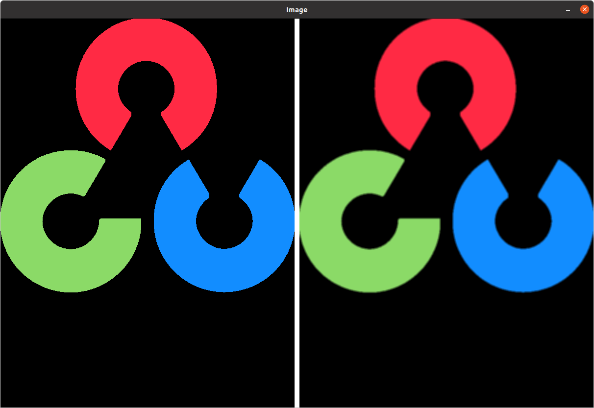
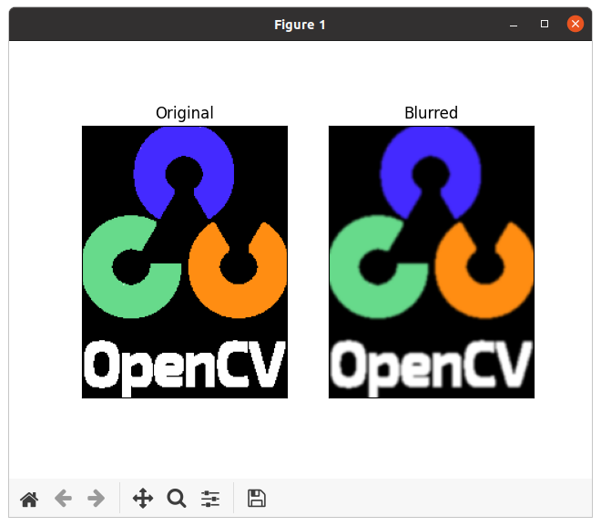
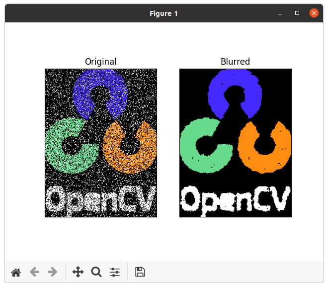
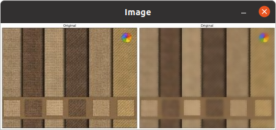

本文主要内容来自于 [OpenCV-Python 教程](https://docs.opencv.org/4.5.5/d6/d00/tutorial_py_root.html) 的 [OpenCV 中的图像处理](https://docs.opencv.org/4.5.5/d2/d96/tutorial_py_table_of_contents_imgproc.html) 部分，这部分的全部主要内容如下：
<!--more-->
-   [改变色彩空间](https://docs.opencv.org/4.5.5/df/d9d/tutorial_py_colorspaces.html)

    学习在不同色彩空间之间改变图像。另外学习跟踪视频中的彩色对象。

-   [图像的几何变换](https://docs.opencv.org/4.5.5/da/d6e/tutorial_py_geometric_transformations.html)

    学习对图像应用不同的几何变换，比如旋转、平移等。

-   [图像阈值](https://docs.opencv.org/4.5.5/d7/d4d/tutorial_py_thresholding.html)

    学习使用全局阈值、自适应阈值、Otsu 的二值化等将图像转换为二值图像。

-   [平滑图像](https://docs.opencv.org/4.5.5/d4/d13/tutorial_py_filtering.html)

    学习模糊图像，使用自定义内核过滤图像等。

-   [形态变换](https://docs.opencv.org/4.5.5/d9/d61/tutorial_py_morphological_ops.html)

    了解形态学变换，如侵蚀、膨胀、开放、闭合等。

-   [图像渐变](https://docs.opencv.org/4.5.5/d5/d0f/tutorial_py_gradients.html)

    学习寻找图像渐变、边缘等。

-   [Canny 边缘检测](https://docs.opencv.org/4.5.5/da/d22/tutorial_py_canny.html)

    学习通过 Canny 边缘检测寻找边缘。

-   [图像金字塔](https://docs.opencv.org/4.5.5/dc/dff/tutorial_py_pyramids.html)

    学习关于图像金字塔的内容，以及如何使用它们进行图像混合。

-   [OpenCV 中的轮廓](https://docs.opencv.org/4.5.5/d3/d05/tutorial_py_table_of_contents_contours.html)

    所有关于 OpenCV 中的轮廓的内容。

-   [OpenCV 中的直方图](https://docs.opencv.org/4.5.5/de/db2/tutorial_py_table_of_contents_histograms.html)

    所有关于 OpenCV 中的直方图的内容。

-   [OpenCV 中的图像变换](https://docs.opencv.org/4.5.5/dd/dc4/tutorial_py_table_of_contents_transforms.html)

    在 OpenCV 中遇到不同的图像变换，如傅里叶变换、余弦变换等。

-   [模板匹配](https://docs.opencv.org/4.5.5/d4/dc6/tutorial_py_template_matching.html)

    学习使用模板匹配在图像中搜索对象。

-   [霍夫线变换](https://docs.opencv.org/4.5.5/d6/d10/tutorial_py_houghlines.html)

    学习在一幅图像中探测线。

-   [霍夫圆变换](https://docs.opencv.org/4.5.5/da/d53/tutorial_py_houghcircles.html)

    学习在一幅图像中探测圆。

-   [使用分水岭算法的图像分割](https://docs.opencv.org/4.5.5/d3/db4/tutorial_py_watershed.html)

    学习使用分水岭分割算法分割图像。

-   [使用 GrabCut 算法的交互式前景提取](https://docs.opencv.org/4.5.5/d8/d83/tutorial_py_grabcut.html)

    学习使用 GrabCut 算法提取前景

## 目标

学习：

 * 使用各种低通滤波器模糊图像
 * 将定制过滤器应用于图像（2D 卷积）

## 2D卷积（图像过滤）

与一维信号一样，图像也可以使用各种低通滤波器 (LPF)、高通滤波器 (HPF) 等进行滤波。LPF 有助于消除噪声、模糊图像等。HPF 过滤器有助于在图像中找到边缘。

OpenCV 提供了一个函数 **[cv.filter2D()](https://docs.opencv.org/4.5.5/d4/d86/group__imgproc__filter.html#ga27c049795ce870216ddfb366086b5a04 "Convolves an image with the kernel. ")**来将内核与图像进行卷积。例如，我们将在图像上尝试平均滤波器。一个 5x5 平均滤波器内核如下所示：

$$K = \frac{1}{25} \begin{bmatrix} 1 & 1 & 1 & 1 & 1 \\ 1 & 1 & 1 & 1 & 1 \\ 1 & 1 & 1 & 1 & 1 \\ 1 & 1 & 1 & 1 & 1 \\ 1 & 1 & 1 & 1 & 1 \end{bmatrix}$$

操作是这样的：保持这个内核高于一个像素，将所有低于这个内核的 25 个像素相加，取平均值，然后用新的平均值替换中心像素。对图像中的所有像素继续该操作。试试这段代码并检查结果：
```
import numpy as np
import cv2 as cv
from matplotlib import pyplot as plt

def image_filtering():
    cv.samples.addSamplesDataSearchPath("/media/data/my_multimedia/opencv-4.x/samples/data")
    img = cv.imread(cv.samples.findFile('opencv-logo.png'))

    kernel = np.ones((5, 5), np.float32) / 25
    dst = cv.filter2D(img, -1, kernel)

    row, col, _ = img.shape

    edge = np.full((row, 10, 3), (255, 255, 255), np.uint8);
    images = [img, edge, dst]
    dst = cv.hconcat(images)

    cv.imshow("Image", dst)

    cv.waitKey(-1)
    cv.destroyAllWindows()


if __name__ == "__main__":
    image_filtering()
```

结果如下：



## 图像模糊（图像平滑）

图像模糊是通过将图像与低通滤波器内核进行卷积来实现的。它对于去除噪声很有用。它实际上从图像中去除了高频内容（比如噪声，边缘）。所以在这个操作中边缘有点模糊（也有不模糊边缘的模糊技术）。OpenCV 提供了四种主要的模糊技术类型。

### 1. 平均

这是通过将图像与归一化框滤波器进行卷积来完成的。它只是取内核区域下所有像素的平均值并替换中心元素。这通过函数 **[cv.blur()](https://docs.opencv.org/4.5.5/d4/d86/group__imgproc__filter.html#ga8c45db9afe636703801b0b2e440fce37 "Blurs an image using the normalized box filter. ")** 或 **[cv.boxFilter()](https://docs.opencv.org/4.5.5/d4/d86/group__imgproc__filter.html#gad533230ebf2d42509547d514f7d3fbc3 "Blurs an image using the box filter. ")** 完成。检查关于内核的文档来了解更多细节。我们应该指定内核的宽度和高度。一个 3x3 归一化框滤波器将看起来像下面这样：

$$
K = \frac{1}{9} \begin{bmatrix} 1 & 1 & 1 \\ 1 & 1 & 1 \\ 1 & 1 & 1 \end{bmatrix}
$$

 > **注意**
 > 如果不想使用归一化的框滤波器，则使用 **[cv.boxFilter()](https://docs.opencv.org/4.5.5/d4/d86/group__imgproc__filter.html#gad533230ebf2d42509547d514f7d3fbc3 "Blurs an image using the box filter. ")**。给函数传递一个参数 *normalize=False*。

看一下下面的示例演示，它使用一个 5x5 大小的内核：
```
def averaging_filter():
    cv.samples.addSamplesDataSearchPath("/media/data/my_multimedia/opencv-4.x/samples/data")
    img = cv.imread(cv.samples.findFile('opencv-logo-white.png'))

    blur = cv.blur(img, (5, 5))

    plt.subplot(121), plt.imshow(img), plt.title('Original')
    plt.xticks([]), plt.yticks([])
    plt.subplot(122), plt.imshow(blur), plt.title('Blurred')
    plt.xticks([]), plt.yticks([])
    plt.show()


if __name__ == "__main__":
    averaging_filter()
```

结果如下：


### 高斯模糊

在这个方法中，不是使用框滤波器，而是使用一个高斯内核。它通过函数 **[cv.GaussianBlur()](https://docs.opencv.org/4.5.5/d4/d86/group__imgproc__filter.html#gaabe8c836e97159a9193fb0b11ac52cf1 "Blurs an image using a Gaussian filter. ")** 完成。我们应该指定内核的宽度和高度，它们应该是正奇数。我们还应该指定 X 和 Y 方向的标准差，sigmaX 和 sigmaY。如果只指定了 sigmaX，sigmaY 将取与 sigmaX 相同的值。如果两者都为零，则它们根据内核大小计算得出。高斯模糊在从图像中移除高斯噪声非常有效。

如果你想，你可以使用函数 **[cv.getGaussianKernel()](https://docs.opencv.org/4.5.5/d4/d86/group__imgproc__filter.html#gac05a120c1ae92a6060dd0db190a61afa "Returns Gaussian filter coefficients. ")** 创建一个高斯内核。

上面的代码可以修改以用于高斯模糊：
```
    blur = cv.GaussianBlur(img, (5, 5), 0)
```

如果使用函数 **[cv.getGaussianKernel()](https://docs.opencv.org/4.5.5/d4/d86/group__imgproc__filter.html#gac05a120c1ae92a6060dd0db190a61afa "Returns Gaussian filter coefficients. ")**，则需要如下的代码：
```
    kernel = cv.getGaussianKernel(5, 0)
    kernel_2D = kernel @ kernel.transpose()
    blur = cv.filter2D(img, -1, kernel_2D)
```

结果如下：



### 3. 中值模糊

这里，函数 **[cv.medianBlur()](https://docs.opencv.org/4.5.5/d4/d86/group__imgproc__filter.html#ga564869aa33e58769b4469101aac458f9 "Blurs an image using the median filter. ")** 取内核区域下所有像素的中值，并将中心元素替换为该中值。这对图像中的椒盐噪声非常有效。有趣的是，在上述滤波器中，中心元素是新计算的值，可能是图像中的像素值或新值。但是在中值模糊中，中心元素总是被图像中的某个像素值替换。它有效地降低了噪音。它的内核大小应该是一个正奇数。

在这个演示中，我为原始图像添加了 50% 的噪点并应用了中值模糊。添加噪点，通过如下的 *salt_and_pepper(image, n)* 函数完成。检查结果：
```
import numpy as np
import cv2 as cv
from matplotlib import pyplot as plt
import random

def salt_and_pepper(image, n):
    print(image.shape)
    for i in range(int(n / 2)):
        row = random.randint(0, image.shape[0] - 1)
        col = random.randint(0, image.shape[1] - 1)

        write_black = random.randint(0, 2)
        if write_black == 0:
            image[row][col] = (255, 255, 255)
        else:
            image[row][col] = (0, 0, 0)
    return image


def median_blurring():
    cv.samples.addSamplesDataSearchPath("/media/data/my_multimedia/opencv-4.x/samples/data")
    img = cv.imread(cv.samples.findFile('opencv-logo-white.png'))

    img = salt_and_pepper(img, img.shape[0] * img.shape[1])

    median = cv.medianBlur(img, 5)

    plt.subplot(121), plt.imshow(img), plt.title('Original')
    plt.xticks([]), plt.yticks([])
    plt.subplot(122), plt.imshow(median), plt.title('Blurred')
    plt.xticks([]), plt.yticks([])
    plt.show()


if __name__ == "__main__":
    median_blurring()
```

结果如下：



### 4. 双边滤波

**[cv.bilateralFilter()](https://docs.opencv.org/4.5.5/d4/d86/group__imgproc__filter.html#ga9d7064d478c95d60003cf839430737ed "Applies the bilateral filter to an image. ")** 函数在保持边缘锐利的同时去除噪声非常有效。但与其它滤波器相比，这个操作速度较慢。我们已经看到高斯滤波器采用像素周围的邻域，并找到其高斯加权平均值。这个高斯滤波器是一个单独的空间函数，即在滤波时考虑附近的像素。它不考虑像素是否具有几乎相同的强度。它不考虑像素是否是边缘像素。所以它也模糊了边缘，这是我们不想做的。

双边滤波在空间上也采用了高斯滤波器，但多了一个高斯滤波器，它是像素差的函数。空间的高斯函数确保只考虑附近的像素进行模糊处理，而强度差异的高斯函数确保只考虑那些与中心像素具有相似强度的像素进行模糊处理。所以它保留了边缘，因为边缘处的像素会有很大的强度变化。

下面的示例显示了双边滤波器的使用（有关参数的详细信息，请访问文档）。
```
def bilateral_blurring():
    cv.samples.addSamplesDataSearchPath("/media/data/my_multimedia/opencv-4.x/samples/data")
    img = cv.imread(cv.samples.findFile('bilateral.jpg'))

    img = img[0:img.shape[0], 0:int(img.shape[1] / 2)]

    blur = cv.bilateralFilter(img, 9, 75, 75)

    images = [img, blur]
    dest = cv.hconcat(images)

    cv.imshow("Image", dest)
    cv.waitKey(-1)
    cv.destroyAllWindows()


if __name__ == "__main__":
    bilateral_blurring()
```

结果如下：



看，表面上的纹理消失了，但边缘依然存在。

## 其它资源

1. 关于 [双边滤波](https://people.csail.mit.edu/sparis/bf_course/) 的详细信息

## 练习

**参考文档**

[Smoothing Images](https://docs.opencv.org/4.5.5/d4/d13/tutorial_py_filtering.html)

[使用带有高斯核的cv2.GaussianBlur和cv2.filter2D的不同结果？](https://www.cnpython.com/qa/447594)

[利用OpenCV给彩色图像添加椒盐噪声的方法](https://www.jb51.net/article/224728.htm)

[使用Python-OpenCV向图片添加噪声的实现(高斯噪声、椒盐噪声)](https://www.jb51.net/article/162073.htm)

[Python 随机数生成](https://www.runoob.com/python3/python3-random-number.html)

Done.
