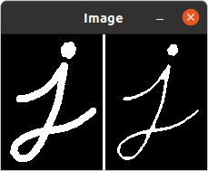
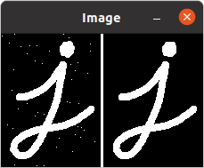
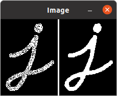
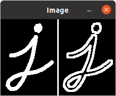
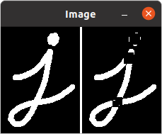
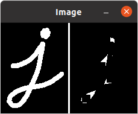

本文主要内容来自于 [OpenCV-Python 教程](https://docs.opencv.org/4.5.5/d6/d00/tutorial_py_root.html) 的 [OpenCV 中的图像处理](https://docs.opencv.org/4.5.5/d2/d96/tutorial_py_table_of_contents_imgproc.html) 部分，这部分的全部主要内容如下：
<!--more-->
-   [改变色彩空间](https://docs.opencv.org/4.5.5/df/d9d/tutorial_py_colorspaces.html)

    学习在不同色彩空间之间改变图像。另外学习跟踪视频中的彩色对象。

-   [图像的几何变换](https://docs.opencv.org/4.5.5/da/d6e/tutorial_py_geometric_transformations.html)

    学习对图像应用不同的几何变换，比如旋转、平移等。

-   [图像阈值](https://docs.opencv.org/4.5.5/d7/d4d/tutorial_py_thresholding.html)

    学习使用全局阈值、自适应阈值、Otsu 的二值化等将图像转换为二值图像。

-   [平滑图像](https://docs.opencv.org/4.5.5/d4/d13/tutorial_py_filtering.html)

    学习模糊图像，使用自定义内核过滤图像等。

-   [形态变换](https://docs.opencv.org/4.5.5/d9/d61/tutorial_py_morphological_ops.html)

    了解形态学变换，如侵蚀、膨胀、开放、闭合等。

-   [图像渐变](https://docs.opencv.org/4.5.5/d5/d0f/tutorial_py_gradients.html)

    学习寻找图像渐变、边缘等。

-   [Canny 边缘检测](https://docs.opencv.org/4.5.5/da/d22/tutorial_py_canny.html)

    学习通过 Canny 边缘检测寻找边缘。

-   [图像金字塔](https://docs.opencv.org/4.5.5/dc/dff/tutorial_py_pyramids.html)

    学习关于图像金字塔的内容，以及如何使用它们进行图像混合。

-   [OpenCV 中的轮廓](https://docs.opencv.org/4.5.5/d3/d05/tutorial_py_table_of_contents_contours.html)

    所有关于 OpenCV 中的轮廓的内容。

-   [OpenCV 中的直方图](https://docs.opencv.org/4.5.5/de/db2/tutorial_py_table_of_contents_histograms.html)

    所有关于 OpenCV 中的直方图的内容。

-   [OpenCV 中的图像变换](https://docs.opencv.org/4.5.5/dd/dc4/tutorial_py_table_of_contents_transforms.html)

    在 OpenCV 中遇到不同的图像变换，如傅里叶变换、余弦变换等。

-   [模板匹配](https://docs.opencv.org/4.5.5/d4/dc6/tutorial_py_template_matching.html)

    学习使用模板匹配在图像中搜索对象。

-   [霍夫线变换](https://docs.opencv.org/4.5.5/d6/d10/tutorial_py_houghlines.html)

    学习在一幅图像中探测线。

-   [霍夫圆变换](https://docs.opencv.org/4.5.5/da/d53/tutorial_py_houghcircles.html)

    学习在一幅图像中探测圆。

-   [使用分水岭算法的图像分割](https://docs.opencv.org/4.5.5/d3/db4/tutorial_py_watershed.html)

    学习使用分水岭分割算法分割图像。

-   [使用 GrabCut 算法的交互式前景提取](https://docs.opencv.org/4.5.5/d8/d83/tutorial_py_grabcut.html)

    学习使用 GrabCut 算法提取前景

## 目标

在本章中：

 * 我们将学习不同的形态学操作，如腐蚀、膨胀、开、闭等。
 * 我们将看到不同的函数，例如：**[cv.erode()](https://docs.opencv.org/4.5.5/d4/d86/group__imgproc__filter.html#gaeb1e0c1033e3f6b891a25d0511362aeb "Erodes an image by using a specific structuring element. ")**，**[cv.dilate()](https://docs.opencv.org/4.5.5/d4/d86/group__imgproc__filter.html#ga4ff0f3318642c4f469d0e11f242f3b6c "Dilates an image by using a specific structuring element. ")**，**[cv.morphologyEx()](https://docs.opencv.org/4.5.5/d4/d86/group__imgproc__filter.html#ga67493776e3ad1a3df63883829375201f "Performs advanced morphological transformations. ")** 等等。

## 理论

形态变换是基于图像形状的一些简单操作。它通常在二值图像上操作。它需要两个输入，一个是我们的原始图像，第二个称为 **结构元素** 或**内核**，其决定了操作的性质。 两个基本的形态学操作是侵蚀和膨胀。然后它的变体形式，如 Opening，Closing，Gradient 等也开始发挥作用。我们将在下图的帮助下一一看看它们：


### 1. 侵蚀

蚀的基本思想就像土壤侵蚀一样，它侵蚀了前景物体的边界（总是尽量保持前景为白色）。那么它有什么作用呢？内核在图像中滑动（如在 2D 卷积中）。只有当内核下的所有像素都为 1 时，原始图像中的一个像素（1 或 0）才会被认为是 1，否则它会被侵蚀（变为 0）。

所以发生的情况是，边界附近的所有像素都将根据内核的大小被丢弃。因此，前景物体的厚度或大小会减小，或者只是图像中的白色区域减小。它对于去除小的白噪声（正如我们在色彩空间章节中所见）、分离两个连接的对象等很有用。

在这里，作为一个例子，我们使用一个 5x5 的内核，其中全是 1。让我们看看它是如何工作的：
```
import cv2 as cv
import numpy as np

def erosion():
    img = cv.imread("/home/zhangsan/j.png", 0)
    kernel = np.ones((5, 5), np.uint8)
    erosion = cv.erode(img, kezhangsanrnel, iterations=1)

    edge = np.full((img.shape[0], 3, 1), 255, np.uint8);

    images = [img, edge, erosion]
    dest = cv.hconcat(images)

    cv.imshow("Image", dest)
    cv.waitKey(-1)


if __name__ == "__main__":
    erosion()
```

结果如下：



### 2. 膨胀

它与侵蚀完全相反。在这里，如果内核下的元素中至少有一个值为 '1'，则像素元素值为 '1'。因此它增加图像中的白色区域，或者增加前景对象的大小。通常，在去除噪声等情况下，侵蚀之后是膨胀。因为，侵蚀消除白噪声，但它也缩小了我们的对象。所以我们扩张它。由于噪音消失了，它们不会回来，但我们的对象面积增加了。它也可用于连接对象的损坏部分。
```
    dilation = cv.dilate(img, kernel, iterations=1)
```

结果如下：


### 3. 开

开只是 **侵蚀后膨胀** 的另一个名称。正如我们上面解释的那样，它在消除噪音方面很有用。这里我们使用函数 **[cv.morphologyEx()](https://docs.opencv.org/4.5.5/d4/d86/group__imgproc__filter.html#ga67493776e3ad1a3df63883829375201f "Performs advanced morphological transformations. ")**。
```
def opening():
    img = cv.imread("/home/hanpfei/j.png", 0)

    for i in range(50):
        row = random.randint(0, img.shape[0] - 1)
        col = random.randint(0, img.shape[1] - 1)
        img[row][col] = 255

    kernel = np.ones((5, 5), np.uint8)
    opening = cv.morphologyEx(img, cv.MORPH_OPEN, kernel)

    edge = np.full((img.shape[0], 3, 1), 255, np.uint8);

    images = [img, edge, opening]
    dest = cv.hconcat(images)

    cv.imshow("Image", dest)
    cv.waitKey(-1)
```

要处理的图像中如果包含一些白色的噪声像素点，效果会比较明显。这里先给输入图像增加了一些白色的噪声像素点。结果如下：



### 4. 闭

闭是开的逆操作，**膨胀后侵蚀**。它对于闭合前景对象内的小孔，或对象上的小黑点很有用。
```
def closing():
    img = cv.imread("/home/hanpfei/j.png", 0)

    for i in range(5000):
        row = random.randint(0, img.shape[0] - 1)
        col = random.randint(0, img.shape[1] - 1)
        img[row][col] = 0

    kernel = np.ones((5, 5), np.uint8)
    closing = cv.morphologyEx(img, cv.MORPH_CLOSE, kernel)

    edge = np.full((img.shape[0], 3, 1), 255, np.uint8);

    images = [img, edge, closing]
    dest = cv.hconcat(images)

    cv.imshow("Image", dest)
    cv.waitKey(-1)


if __name__ == "__main__":
    closing()
```

这里同样先在输入图像上制造一些噪声点，不过这次是黑色噪声像素点。由于大多数黑色噪声点会落在黑色的背景区域内而看不出效果，所以这里制造更多的噪声点。最终的结果如下：



### 5. 形态梯度

它是一幅图像的膨胀和侵蚀之间的差值。

结果将看起来像是对象的轮廓。
```
    gradient = cv.morphologyEx(img, cv.MORPH_GRADIENT, kernel)
```

结果如下：



### 6. 礼帽

它是输入图像和图像的开的插值。下面的示例是针对 9x9 内核完成的。
```
def top_hat():
    img = cv.imread("/home/hanpfei/j.png", 0)

    kernel = np.ones((9, 9), np.uint8)
    tophat = cv.morphologyEx(img, cv.MORPH_TOPHAT, kernel)

    edge = np.full((img.shape[0], 3, 1), 255, np.uint8);

    images = [img, edge, tophat]
    dest = cv.hconcat(images)

    cv.imshow("Image", dest)
    cv.waitKey(-1)
```

结果如下：



### 7. 黑帽

它是输入图像和图像的闭的插值。下面的示例是针对 9x9 内核完成的。
```
    tophat = cv.morphologyEx(img, cv.MORPH_BLACKHAT, kernel)
```

结果如下：



## 结构元素

我们在 Numpy 的帮助下手动创建前面的示例中的结构元素。它是矩形的。但在某些情况下，你可能需要 椭圆形/圆形 的内核。所以为了这个目的，OpenCV 有一个函数，**[cv.getStructuringElement()](https://docs.opencv.org/4.5.5/d4/d86/group__imgproc__filter.html#gac342a1bb6eabf6f55c803b09268e36dc "Returns a structuring element of the specified size and shape for morphological operations. ")**。我们只需传入内核的形状和大小，就可以得到想要的内核。
```
# Rectangular Kernel
>>> cv.getStructuringElement(cv.MORPH_RECT,(5,5))
array([[1, 1, 1, 1, 1],
       [1, 1, 1, 1, 1],
       [1, 1, 1, 1, 1],
       [1, 1, 1, 1, 1],
       [1, 1, 1, 1, 1]], dtype=uint8)
# Elliptical Kernel
>>> cv.getStructuringElement(cv.MORPH_ELLIPSE,(5,5))
array([[0, 0, 1, 0, 0],
       [1, 1, 1, 1, 1],
       [1, 1, 1, 1, 1],
       [1, 1, 1, 1, 1],
       [0, 0, 1, 0, 0]], dtype=uint8)
# Cross-shaped Kernel
>>> cv.getStructuringElement(cv.MORPH_CROSS,(5,5))
array([[0, 0, 1, 0, 0],
       [0, 0, 1, 0, 0],
       [1, 1, 1, 1, 1],
       [0, 0, 1, 0, 0],
       [0, 0, 1, 0, 0]], dtype=uint8)
```

## 其它资源

1.  HIPR2 的 [Morphological Operations](http://homepages.inf.ed.ac.uk/rbf/HIPR2/morops.htm)

## 练习

**参考文档**

[Morphological Transformations](https://docs.opencv.org/4.5.5/d9/d61/tutorial_py_morphological_ops.html)

Done.
