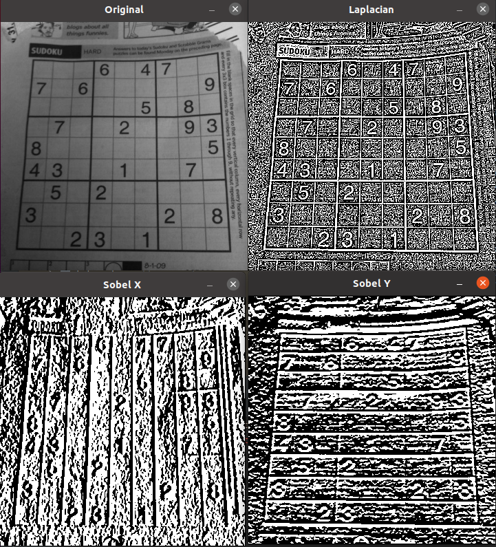
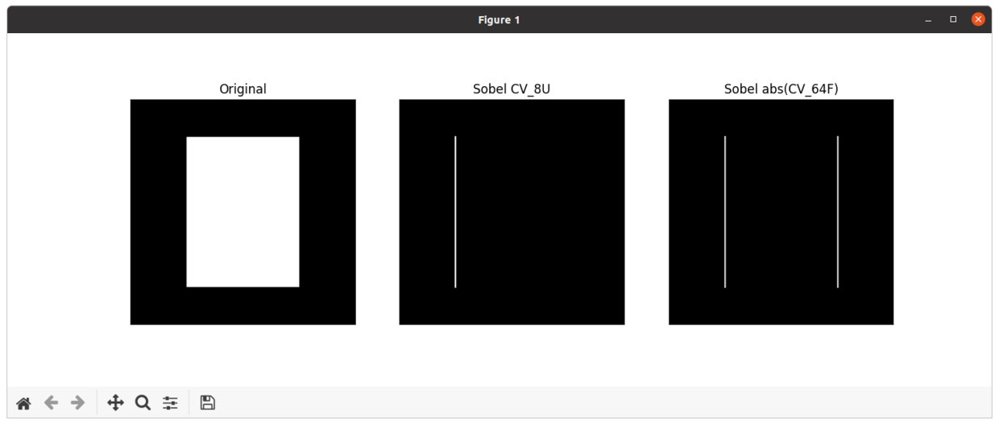

本文主要内容来自于 [OpenCV-Python 教程](https://docs.opencv.org/4.5.5/d6/d00/tutorial_py_root.html) 的 [OpenCV 中的图像处理](https://docs.opencv.org/4.5.5/d2/d96/tutorial_py_table_of_contents_imgproc.html) 部分，这部分的全部主要内容如下：
<!--more-->
-   [改变色彩空间](https://docs.opencv.org/4.5.5/df/d9d/tutorial_py_colorspaces.html)

    学习在不同色彩空间之间改变图像。另外学习跟踪视频中的彩色对象。

-   [图像的几何变换](https://docs.opencv.org/4.5.5/da/d6e/tutorial_py_geometric_transformations.html)

    学习对图像应用不同的几何变换，比如旋转、平移等。

-   [图像阈值](https://docs.opencv.org/4.5.5/d7/d4d/tutorial_py_thresholding.html)

    学习使用全局阈值、自适应阈值、Otsu 的二值化等将图像转换为二值图像。

-   [平滑图像](https://docs.opencv.org/4.5.5/d4/d13/tutorial_py_filtering.html)

    学习模糊图像，使用自定义内核过滤图像等。

-   [形态变换](https://docs.opencv.org/4.5.5/d9/d61/tutorial_py_morphological_ops.html)

    了解形态学变换，如侵蚀、膨胀、开放、闭合等。

-   [图像渐变](https://docs.opencv.org/4.5.5/d5/d0f/tutorial_py_gradients.html)

    学习寻找图像渐变、边缘等。

-   [Canny 边缘检测](https://docs.opencv.org/4.5.5/da/d22/tutorial_py_canny.html)

    学习通过 Canny 边缘检测寻找边缘。

-   [图像金字塔](https://docs.opencv.org/4.5.5/dc/dff/tutorial_py_pyramids.html)

    学习关于图像金字塔的内容，以及如何使用它们进行图像混合。

-   [OpenCV 中的轮廓](https://docs.opencv.org/4.5.5/d3/d05/tutorial_py_table_of_contents_contours.html)

    所有关于 OpenCV 中的轮廓的内容。

-   [OpenCV 中的直方图](https://docs.opencv.org/4.5.5/de/db2/tutorial_py_table_of_contents_histograms.html)

    所有关于 OpenCV 中的直方图的内容。

-   [OpenCV 中的图像变换](https://docs.opencv.org/4.5.5/dd/dc4/tutorial_py_table_of_contents_transforms.html)

    在 OpenCV 中遇到不同的图像变换，如傅里叶变换、余弦变换等。

-   [模板匹配](https://docs.opencv.org/4.5.5/d4/dc6/tutorial_py_template_matching.html)

    学习使用模板匹配在图像中搜索对象。

-   [霍夫线变换](https://docs.opencv.org/4.5.5/d6/d10/tutorial_py_houghlines.html)

    学习在一幅图像中探测线。

-   [霍夫圆变换](https://docs.opencv.org/4.5.5/da/d53/tutorial_py_houghcircles.html)

    学习在一幅图像中探测圆。

-   [使用分水岭算法的图像分割](https://docs.opencv.org/4.5.5/d3/db4/tutorial_py_watershed.html)

    学习使用分水岭分割算法分割图像。

-   [使用 GrabCut 算法的交互式前景提取](https://docs.opencv.org/4.5.5/d8/d83/tutorial_py_grabcut.html)

    学习使用 GrabCut 算法提取前景

## 目标

在本章中，我们将学习：

 * 寻找图像的渐变，边缘等。
 * 我们将看下如下的函数： **[cv.Sobel()](https://docs.opencv.org/4.5.5/d4/d86/group__imgproc__filter.html#gacea54f142e81b6758cb6f375ce782c8d "Calculates the first, second, third, or mixed image derivatives using an extended Sobel operator...")**，**[cv.Scharr()](https://docs.opencv.org/4.5.5/d4/d86/group__imgproc__filter.html#gaa13106761eedf14798f37aa2d60404c9 "Calculates the first x- or y- image derivative using Scharr operator. ")**，**[cv.Laplacian()](https://docs.opencv.org/4.5.5/d4/d86/group__imgproc__filter.html#gad78703e4c8fe703d479c1860d76429e6 "Calculates the Laplacian of an image. ")** 等等。

## 理论

OpenCV 提供了三种类型的渐变滤波器或高通滤波器，Sobel、Scharr 和 Laplacian。我们将看下它们中的每一个。

### 1. Sobel 和 Scharr 导数

Sobel 算子是联合高斯平滑加微分运算，所以抗噪声能力更强。我们可以指定要采用的导数方向，垂直或水平（分别通过参数 `yorder` 和 `xorder`）。你也可以通过参数 `ksize` 指定内核的大小。如果 `ksize = -1`，则将使用一个 3x3 Scharr 滤波器，相对于 3x3 Sobel 滤波器它能给出更好的结果。请参考所使用的内核的文档。

### 2. Laplacian 导数 

它计算由关系 $\Delta src = \frac{\partial ^2{src}}{\partial x^2} + \frac{\partial ^2{src}}{\partial y^2}$ 给出的图像的拉普拉斯算子，其中每个导数都是使用 Sobel 导数找到的。如果 `ksize = 1`，则将使用如下的内核用于滤波
$$
kernel = \begin{bmatrix} 0 & 1 & 0 \\ 1 & -4 & 1 \\ 0 & 1 & 0 \end{bmatrix}
$$

## 代码

下面的代码在一幅图中展示了所有这些操作。所有的内核都是 5x5 大小的。输出图像的深度传入 -1，以获得 `np.uint8` 类型的结果。
```
import numpy as np
import cv2 as cv
from matplotlib import pyplot as plt

def image_gradients():
    cv.samples.addSamplesDataSearchPath("/media/data/my_multimedia/opencv-4.x/samples/data")
    img = cv.imread(cv.samples.findFile('sudoku.png'), 0)
    print(img.shape)
    img = cv.resize(img, (359, 361))
    laplacian = cv.Laplacian(img, cv.CV_64F)
    sobelx = cv.Sobel(img, cv.CV_64F, 1, 0, ksize=5)
    sobely = cv.Sobel(img, cv.CV_64F, 0, 1, ksize=5)

    cv.imshow("Original", img)
    cv.imshow("Laplacian", laplacian)
    cv.imshow("Sobel X", sobelx)
    cv.imshow("Sobel Y", sobely)

    cv.waitKey(-1)
    cv.destroyAllWindows()


if __name__ == "__main__":
    image_gradients()
```

结果如下：



## 一个重要的问题

在我们的上一个例子中，输出数据类型是 `cv.CV_8U` 或 `np.uint8`。但这有一个小问题。黑色到白色的过渡被视为正斜率（它具有正值），而白色到黑色的过渡被视为负斜率（它具有负值）。因此当你将数据转为 `np.uint8` 时，所有的负斜率都被设置为了 0。简单来说，就是丢失了边缘。

如果我们想要探测两个边缘，更好的选项是保持输出数据类型为一些更高的形式，比如 `cv.CV_16S`，`cv.CV_64F` 等等，取它的绝对值，然后将它转回 `cv.CV_8U`。下面的代码演示了水平 Sobel 滤波器的此过程和结果差异。
```
import numpy as np
import cv2 as cv
from matplotlib import pyplot as plt

def image_gradients2():
    img = np.zeros((600, 600))
    cv.rectangle(img, (150, 100), (450, 500), (255), -1)

    # Output dtype = cv.CV_8U
    sobelx8u = cv.Sobel(img, cv.CV_8U, 1, 0, ksize=5)

    # Output dtype = cv.CV_64F. Then take its absolute and convert to cv.CV_8U
    sobelx64f = cv.Sobel(img, cv.CV_64F, 1, 0, ksize=5)
    abs_sobel64f = np.absolute(sobelx64f)
    sobel_8u = np.uint8(abs_sobel64f)

    plt.subplot(1, 3, 1), plt.imshow(img, cmap='gray')
    plt.title('Original'), plt.xticks([]), plt.yticks([])
    plt.subplot(1, 3, 2), plt.imshow(sobelx8u, cmap='gray')
    plt.title('Sobel CV_8U'), plt.xticks([]), plt.yticks([])
    plt.subplot(1, 3, 3), plt.imshow(sobel_8u, cmap='gray')
    plt.title('Sobel abs(CV_64F)'), plt.xticks([]), plt.yticks([])

    plt.show()


if __name__ == "__main__":
    image_gradients2()
```

检查结果如下：



## 其它资源

## 练习

**参考文档**

[Image Gradients](https://docs.opencv.org/4.5.5/d5/d0f/tutorial_py_gradients.html)

Done.
