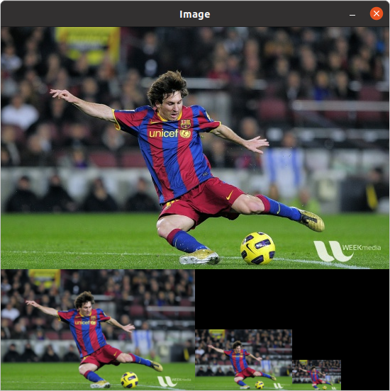
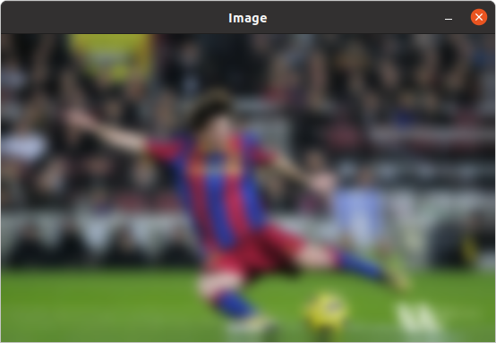
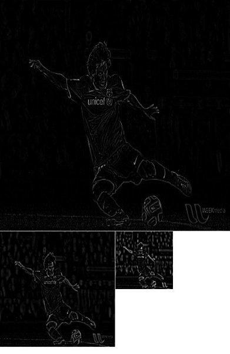
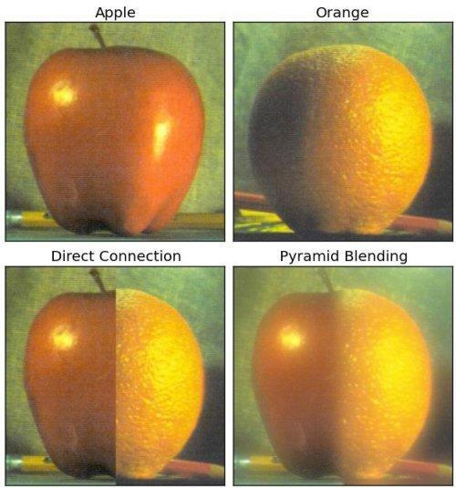

本文主要内容来自于 [OpenCV-Python 教程](https://docs.opencv.org/4.5.5/d6/d00/tutorial_py_root.html) 的 [OpenCV 中的图像处理](https://docs.opencv.org/4.5.5/d2/d96/tutorial_py_table_of_contents_imgproc.html) 部分，这部分的全部主要内容如下：
<!--more-->
-   [改变色彩空间](https://docs.opencv.org/4.5.5/df/d9d/tutorial_py_colorspaces.html)

    学习在不同色彩空间之间改变图像。另外学习跟踪视频中的彩色对象。

-   [图像的几何变换](https://docs.opencv.org/4.5.5/da/d6e/tutorial_py_geometric_transformations.html)

    学习对图像应用不同的几何变换，比如旋转、平移等。

-   [图像阈值](https://docs.opencv.org/4.5.5/d7/d4d/tutorial_py_thresholding.html)

    学习使用全局阈值、自适应阈值、Otsu 的二值化等将图像转换为二值图像。

-   [平滑图像](https://docs.opencv.org/4.5.5/d4/d13/tutorial_py_filtering.html)

    学习模糊图像，使用自定义内核过滤图像等。

-   [形态变换](https://docs.opencv.org/4.5.5/d9/d61/tutorial_py_morphological_ops.html)

    了解形态学变换，如侵蚀、膨胀、开放、闭合等。

-   [图像渐变](https://docs.opencv.org/4.5.5/d5/d0f/tutorial_py_gradients.html)

    学习寻找图像渐变、边缘等。

-   [Canny 边缘检测](https://docs.opencv.org/4.5.5/da/d22/tutorial_py_canny.html)

    学习通过 Canny 边缘检测寻找边缘。

-   [图像金字塔](https://docs.opencv.org/4.5.5/dc/dff/tutorial_py_pyramids.html)

    学习关于图像金字塔的内容，以及如何使用它们进行图像混合。

-   [OpenCV 中的轮廓](https://docs.opencv.org/4.5.5/d3/d05/tutorial_py_table_of_contents_contours.html)

    所有关于 OpenCV 中的轮廓的内容。

-   [OpenCV 中的直方图](https://docs.opencv.org/4.5.5/de/db2/tutorial_py_table_of_contents_histograms.html)

    所有关于 OpenCV 中的直方图的内容。

-   [OpenCV 中的图像变换](https://docs.opencv.org/4.5.5/dd/dc4/tutorial_py_table_of_contents_transforms.html)

    在 OpenCV 中遇到不同的图像变换，如傅里叶变换、余弦变换等。

-   [模板匹配](https://docs.opencv.org/4.5.5/d4/dc6/tutorial_py_template_matching.html)

    学习使用模板匹配在图像中搜索对象。

-   [霍夫线变换](https://docs.opencv.org/4.5.5/d6/d10/tutorial_py_houghlines.html)

    学习在一幅图像中探测线。

-   [霍夫圆变换](https://docs.opencv.org/4.5.5/da/d53/tutorial_py_houghcircles.html)

    学习在一幅图像中探测圆。

-   [使用分水岭算法的图像分割](https://docs.opencv.org/4.5.5/d3/db4/tutorial_py_watershed.html)

    学习使用分水岭分割算法分割图像。

-   [使用 GrabCut 算法的交互式前景提取](https://docs.opencv.org/4.5.5/d8/d83/tutorial_py_grabcut.html)

    学习使用 GrabCut 算法提取前景

## 目标

在本章中，

 * 我们将学习关于图像金字塔的内容
 * 我们将使用图像金字塔创建一种新水果，“橙子苹果”
 * 我们将看到这些函数：**[cv.pyrUp()](https://docs.opencv.org/4.5.5/d4/d86/group__imgproc__filter.html#gada75b59bdaaca411ed6fee10085eb784 "Upsamples an image and then blurs it. ")**，**[cv.pyrDown()](https://docs.opencv.org/4.5.5/d4/d86/group__imgproc__filter.html#gaf9bba239dfca11654cb7f50f889fc2ff "Blurs an image and downsamples it. ")**

## 理论

通常，我们使用固定大小的图像。但在某些情况下，我们需要处理不同分辨率的（相同）图像。例如，在搜索图像中的某些内容时，例如人脸，我们不确定该对象在所述图像中的大小。在这种情况下，我们需要创建一组具有不同分辨率的相同图像，并在所有图像中搜索对象。这组具有不同分辨率的图像称为 **图像金字塔**（这是因为当把它们放进一个栈中，具有最高分辨率的图像位于底部，具有最低分辨率的图像位于顶部时，它看起来就像一个金字塔一样）。

有两种类型的图像金字塔。1) 高斯金字塔和 2) 拉普拉斯金字塔。

高斯金字塔中更高层（分辨率更低）的图像通过移除更低层（分辨率更高）图像中的连续行和列形成。这样更高层中的每个像素由低层中的 5 个像素与高斯权重的贡献形成。通过这样做，一个 $M \times N$ 的图像变为了 $M/2 \times N/2$ 的图像。由此面积缩小为原始图像的四分之一。它被称为八度。随着我们在金字塔中向上层（即分辨率降低）走，相同的模式继续存在。同样，在扩展时，每层的面积变成 4 倍。我们使用 **[cv.pyrDown()](https://docs.opencv.org/4.5.5/d4/d86/group__imgproc__filter.html#gaf9bba239dfca11654cb7f50f889fc2ff "Blurs an image and downsamples it. ")** 和 **[cv.pyrUp()](https://docs.opencv.org/4.5.5/d4/d86/group__imgproc__filter.html#gada75b59bdaaca411ed6fee10085eb784 "Upsamples an image and then blurs it. ")** 函数可以找到高斯金字塔。

```
import numpy as np
import cv2 as cv

def image_pyramids():
    cv.samples.addSamplesDataSearchPath("/media/data/my_multimedia/opencv-4.x/samples/data")
    img = cv.imread(cv.samples.findFile('messi5.jpg'))
    print(img.shape)
    #print(img.dims)

    lower_reso = cv.pyrDown(img)

    dest_images = np.zeros((lower_reso.shape[0] + img.shape[0], img.shape[1], 3), np.uint8)
    dest_images[:img.shape[0], :] = img
    print(dest_images.shape)

    dest_images[img.shape[0]:, :lower_reso.shape[1]] = lower_reso

    lower_reso1 = cv.pyrDown(lower_reso)
    dest_images[img.shape[0] + lower_reso.shape[0] - lower_reso1.shape[0]:, lower_reso.shape[1]:(lower_reso.shape[1] + lower_reso1.shape[1])] = lower_reso1

    lower_reso2 = cv.pyrDown(lower_reso1)
    dest_images[img.shape[0] + lower_reso.shape[0] - lower_reso2.shape[0]:,
        (lower_reso.shape[1] + lower_reso1.shape[1]):(lower_reso.shape[1] + lower_reso1.shape[1] + lower_reso2.shape[1])] = lower_reso2

    cv.imshow("Image", dest_images)
    cv.waitKey(-1)
    cv.destroyAllWindows()


if __name__ == "__main__":
    image_pyramids()
```

下面是包含 4 层的图像金字塔中。



现在我们可以通过 **[cv.pyrUp()](https://docs.opencv.org/4.5.5/d4/d86/group__imgproc__filter.html#gada75b59bdaaca411ed6fee10085eb784 "Upsamples an image and then blurs it. ")** 函数沿图像金字塔向下走。

```
import numpy as np
import cv2 as cv

def image_pyramids1():
    cv.samples.addSamplesDataSearchPath("/media/data/my_multimedia/opencv-4.x/samples/data")
    img = cv.imread(cv.samples.findFile('messi5.jpg'))

    lower_reso = cv.pyrDown(img)
    lower_reso = cv.pyrDown(lower_reso)
    lower_reso = cv.pyrDown(lower_reso)

    dest_images = cv.pyrUp(lower_reso)
    dest_images = cv.pyrUp(dest_images)
    dest_images = cv.pyrUp(dest_images)

    cv.imshow("Image", dest_images)
    cv.waitKey(-1)
    cv.destroyAllWindows()


if __name__ == "__main__":
    image_pyramids1()
```

记住，`higher_reso2` 不等于 `higher_reso`，因为一旦我们降低了分辨率，我们就丢失了一部分信息了。下图是从前一种情况下的最小图像创建的金字塔的 3 级。将其与原始图像进行比较：



拉普拉斯金字塔由高斯金字塔构造而来。没有专门的函数。拉普拉斯金字塔图像仅类似于边缘图像。它的大部分元素为零。它们用于图像压缩。拉普拉斯金字塔中的一个层次是由高斯金字塔中的该层次与高斯金字塔中其上层的扩展版本之间的差异形成的。拉普拉斯层级的三个层级将如下所示（调整对比度以增强内容）：



## 使用金字塔进行图像混合

图像金字塔的一个应用为图像混合。比如，在图像拼接中，我们需要将两张图像堆叠在一起，但由于图像之间的不连续性，它可能看起来不太好。在这种情况下，使用图像金字塔进行图像混合可为您提供无缝混合，而不会在图像中留下太多数据。一个典型的例子是混合两种水果，橙子和苹果。现在查看结果本身以了解具体在说什么：



请首先参考其它资源中给出的资料。它有关于图像混合、拉普拉斯金字塔等的完整图解细节。简单来说它是这样做的：

  1. 加载苹果和橙子的两幅图片
  2. 找到苹果和橙子的高斯金字塔（在这个特定的例子中，层的数量为 6）
  3. 从高斯金字塔中找到它们的拉普拉斯金字塔
  4. 现在合并拉普拉斯金字塔的每层中，苹果的左半边和橙子的右半边
  5. 最后，从这种合并的图像金字塔，重新构建原始图像。

下面是完整的代码。（出于简化代码的目的，每一步都分开完成，这可能会消耗更多内存。可以根据自己打需要优化它）。
```
import cv2 as cv
import numpy as np,sys

def image_pyramids2():
    cv.samples.addSamplesDataSearchPath("/media/data/my_multimedia/opencv-4.x/samples/data")
    A = cv.imread(cv.samples.findFile('apple.jpg'))
    B = cv.imread(cv.samples.findFile('orange.jpg'))

    # generate Gaussian pyramid for A
    G = A.copy()
    gpA = [G]
    for i in range(6):
        G = cv.pyrDown(G)
        gpA.append(G)

    # generate Gaussian pyramid for B
    G = B.copy()
    gpB = [G]
    for i in range(6):
        G = cv.pyrDown(G)
        gpB.append(G)

    # generate Laplacian Pyramid for A
    lpA = [gpA[5]]
    for i in range(5, 0, -1):
        GE = cv.pyrUp(gpA[i])
        L = cv.subtract(gpA[i - 1], GE)
        lpA.append(L)

    # generate Laplacian Pyramid for B
    lpB = [gpB[5]]
    for i in range(5, 0, -1):
        GE = cv.pyrUp(gpB[i])
        L = cv.subtract(gpB[i - 1], GE)
        lpB.append(L)

    # Now add left and right halves of images in each level
    LS = []
    for la, lb in zip(lpA, lpB):
        rows, cols, dpt = la.shape
        ls = np.hstack((la[:, 0:cols // 2], lb[:, cols // 2:]))
        LS.append(ls)

    # now reconstruct
    ls_ = LS[0]
    for i in range(1, 6):
        ls_ = cv.pyrUp(ls_)
        ls_ = cv.add(ls_, LS[i])

    # image with direct connecting each half
    real = np.hstack((A[:, :cols // 2], B[:, cols // 2:]))
    cv.imwrite('Pyramid_blending2.jpg', ls_)
    cv.imwrite('Direct_blending.jpg', real)


if __name__ == "__main__":
    image_pyramids2()
```

## 其它资源

1.  [图像混合](http://pages.cs.wisc.edu/~csverma/CS766_09/ImageMosaic/imagemosaic.html)

## 练习

**参考文档**

[Image Pyramids](https://docs.opencv.org/4.5.5/dc/dff/tutorial_py_pyramids.html)

Done.
