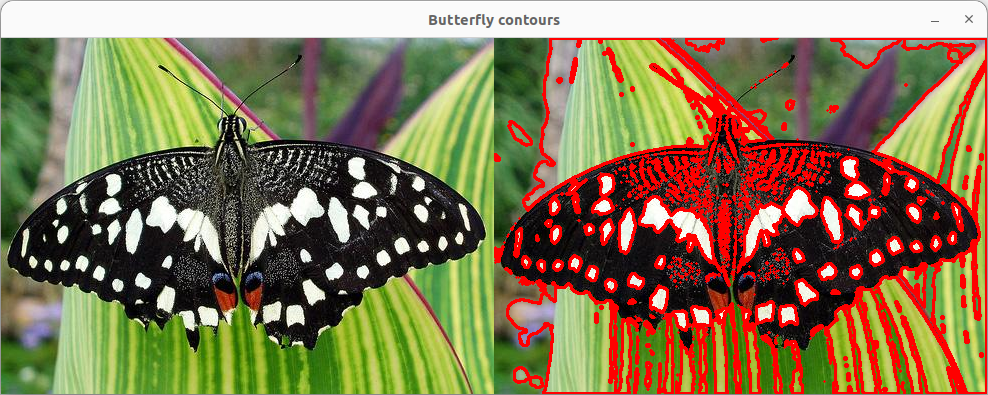
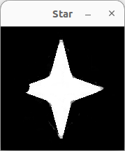
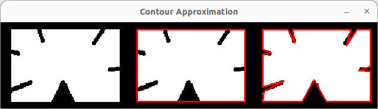
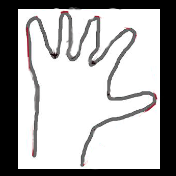
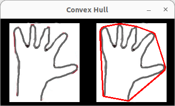
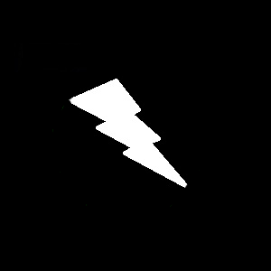
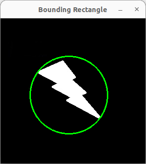
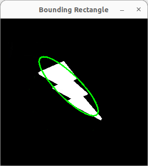
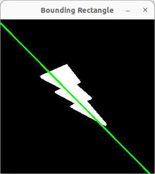

本文主要内容来自于 [OpenCV-Python 教程](https://docs.opencv.org/4.5.5/d6/d00/tutorial_py_root.html) 的 [OpenCV 中的图像处理](https://docs.opencv.org/4.5.5/d2/d96/tutorial_py_table_of_contents_imgproc.html) 部分，这部分的全部主要内容如下：
<!--more-->
-   [改变色彩空间](https://docs.opencv.org/4.5.5/df/d9d/tutorial_py_colorspaces.html)

    学习在不同色彩空间之间改变图像。另外学习跟踪视频中的彩色对象。

-   [图像的几何变换](https://docs.opencv.org/4.5.5/da/d6e/tutorial_py_geometric_transformations.html)

    学习对图像应用不同的几何变换，比如旋转、平移等。

-   [图像阈值](https://docs.opencv.org/4.5.5/d7/d4d/tutorial_py_thresholding.html)

    学习使用全局阈值、自适应阈值、Otsu 的二值化等将图像转换为二值图像。

-   [平滑图像](https://docs.opencv.org/4.5.5/d4/d13/tutorial_py_filtering.html)

    学习模糊图像，使用自定义内核过滤图像等。

-   [形态变换](https://docs.opencv.org/4.5.5/d9/d61/tutorial_py_morphological_ops.html)

    了解形态学变换，如侵蚀、膨胀、开放、闭合等。

-   [图像渐变](https://docs.opencv.org/4.5.5/d5/d0f/tutorial_py_gradients.html)

    学习寻找图像渐变、边缘等。

-   [Canny 边缘检测](https://docs.opencv.org/4.5.5/da/d22/tutorial_py_canny.html)

    学习通过 Canny 边缘检测寻找边缘。

-   [图像金字塔](https://docs.opencv.org/4.5.5/dc/dff/tutorial_py_pyramids.html)

    学习关于图像金字塔的内容，以及如何使用它们进行图像混合。

-   [OpenCV 中的轮廓](https://docs.opencv.org/4.5.5/d3/d05/tutorial_py_table_of_contents_contours.html)

    所有关于 OpenCV 中的轮廓的内容。

-   [OpenCV 中的直方图](https://docs.opencv.org/4.5.5/de/db2/tutorial_py_table_of_contents_histograms.html)

    所有关于 OpenCV 中的直方图的内容。

-   [OpenCV 中的图像变换](https://docs.opencv.org/4.5.5/dd/dc4/tutorial_py_table_of_contents_transforms.html)

    在 OpenCV 中遇到不同的图像变换，如傅里叶变换、余弦变换等。

-   [模板匹配](https://docs.opencv.org/4.5.5/d4/dc6/tutorial_py_template_matching.html)

    学习使用模板匹配在图像中搜索对象。

-   [霍夫线变换](https://docs.opencv.org/4.5.5/d6/d10/tutorial_py_houghlines.html)

    学习在一幅图像中探测线。

-   [霍夫圆变换](https://docs.opencv.org/4.5.5/da/d53/tutorial_py_houghcircles.html)

    学习在一幅图像中探测圆。

-   [使用分水岭算法的图像分割](https://docs.opencv.org/4.5.5/d3/db4/tutorial_py_watershed.html)

    学习使用分水岭分割算法分割图像。

-   [使用 GrabCut 算法的交互式前景提取](https://docs.opencv.org/4.5.5/d8/d83/tutorial_py_grabcut.html)

    学习使用 GrabCut 算法提取前景

# 轮廓：入门

### 目标

 * 理解轮廓是什么
 * 学习寻找轮廓，绘制轮廓等
 * 我们将看到这些函数：**[cv.findContours()](https://docs.opencv.org/4.5.5/d3/dc0/group__imgproc__shape.html#gadf1ad6a0b82947fa1fe3c3d497f260e0 "Finds contours in a binary image. ")**，**[cv.drawContours()](https://docs.opencv.org/4.5.5/d6/d6e/group__imgproc__draw.html#ga746c0625f1781f1ffc9056259103edbc "Draws contours outlines or filled contours. ")**

### 轮廓是什么？

轮廓可以简单地解释为连接所有连续点（沿边界）的曲线，具有相同的颜色或强度。轮廓对于形状分析，目标探测和识别是一个很有用的工具。

 * 为了更高的精度，使用二值图像。因此，在寻找轮廓之前，应用阈值或 canny 边缘探测
 * 自 OpenCV 3.2 开始，[findContours()](https://docs.opencv.org/4.5.5/d3/dc0/group__imgproc__shape.html#gadf1ad6a0b82947fa1fe3c3d497f260e0 "Finds contours in a binary image. ") 不再修改原始图像
 * 在 OpenCV 中，寻找轮廓就像从黑色背景中找出白色物体一样。因此要记得，要寻找的物体应该为白色的，背景应该为黑色的。

让我们看一下如何寻找二值图像的轮廓：
```
import numpy as np
import cv2 as cv


def simple_find_contours():
    cv.samples.addSamplesDataSearchPath("/home/hanpfei/data/multimedia/opencv/samples/data")
    img = cv.imread(cv.samples.findFile('butterfly.jpg'))
    imgray = cv.cvtColor(img, cv.COLOR_BGR2GRAY)
    ret, thresh = cv.threshold(imgray, 127, 255, 0)
    contours, hierarchy = cv.findContours(thresh, cv.RETR_TREE, cv.CHAIN_APPROX_SIMPLE)
    print("hierarchy shape ", hierarchy.shape)


if __name__ == '__main__':
    simple_find_contours()
```

可以看到，**[cv.findContours()](https://docs.opencv.org/4.5.5/d3/dc0/group__imgproc__shape.html#gadf1ad6a0b82947fa1fe3c3d497f260e0 "Finds contours in a binary image. ")** 函数中有三个参数，第一个是源图像，第二个是轮廓检索模式，第三个是轮廓逼近法。它输出轮廓和层次结构。轮廓为图像中所有轮廓的 Python 列表。每个单独的轮廓为一个物体的边界点的 (x,y) 坐标的 Numpy 数组。

> **注意**
> 我们将在后面讨论第二个和第三个参数，以及层次结构的详细内容。在那之前，代码示例中给它们的值将适用于所有图像。

### 如何绘制轮廓？

要想绘制轮廓，可以使用 [cv.drawContours](https://docs.opencv.org/4.5.5/d6/d6e/group__imgproc__draw.html#ga746c0625f1781f1ffc9056259103edbc "Draws contours outlines or filled contours. ") 函数。只要你有边界点，它也可以用于绘制任何形状。它的第一个参数是源图像，第二个参数是应该以 Python 列表的形式传入的轮廓，第三个参数是轮廓的索引（绘制单个轮廓时很有用。要绘制所有轮廓，请传递 -1），其余的参数为颜色，粗细度等等。

 * 在图像中绘制所有轮廓的方法如下：
```
cv.drawContours(img, contours, -1, (0,255,0), 3)
```

 * 在图像中绘制单个轮廓，比如第 4 个轮廓的方法如下：
```
cv.drawContours(img, contours, 3, (0,255,0), 3)
```

 * 但在大多数时候，下面的方法将很有用：
```
cnt = contours[4]
cv.drawContours(img, [cnt], 0, (0,255,0), 3)
```

在上面的示例代码中添加在原图像中绘制轮廓的逻辑，并显示原图像和包含轮廓的图像的代码如下：
```
import numpy as np
import cv2 as cv


def simple_find_contours():
    cv.samples.addSamplesDataSearchPath("/home/hanpfei/data/multimedia/opencv/samples/data")
    img = cv.imread(cv.samples.findFile('butterfly.jpg'))
    img_original = img.copy()
    imgray = cv.cvtColor(img, cv.COLOR_BGR2GRAY)
    ret, thresh = cv.threshold(imgray, 127, 255, 0)
    contours, hierarchy = cv.findContours(thresh, cv.RETR_TREE, cv.CHAIN_APPROX_SIMPLE)

    cv.drawContours(img, contours, -1, (0, 0, 255), 2)

    dst = cv.hconcat([img_original, img])
    cv.imshow("Butterfly contours", dst)

    cv.waitKey(-1)
    cv.destroyAllWindows()


if __name__ == '__main__':
    simple_find_contours()
```

看到的结果应该像下面这样：



## 轮廓逼近法

这是 [cv.findContours](https://docs.opencv.org/4.5.5/d3/dc0/group__imgproc__shape.html#gadf1ad6a0b82947fa1fe3c3d497f260e0 "Finds contours in a binary image. ") 函数的第三个参数。它实际上表示什么呢？

上面，我们提到过轮廓是具有相同强度的形状的边界。它存储形状的边界的 (x,y) 坐标。但它存储所有的坐标么？这由轮廓逼近法指定。

如果传入 [cv.CHAIN_APPROX_NONE](https://docs.opencv.org/4.5.5/d3/dc0/group__imgproc__shape.html#gga4303f45752694956374734a03c54d5ffaf7d9a3582d021d5dadcb0e37201a62f8)，则存储所有的边界点。但实际上我们需要所有的点么？比如，你找到了一条直线轮廓。你需要直线上的所有点来表示它么？不，我们只需要直线两端的点即可。这就是  [cv.CHAIN_APPROX_SIMPLE](https://docs.opencv.org/4.5.5/d3/dc0/group__imgproc__shape.html#gga4303f45752694956374734a03c54d5ffa5f2883048e654999209f88ba04c302f5) 所作的事情。它移除所有的冗余点并压缩轮廓，从而节省内存。

下面的矩形图像演示了这种技术。只需在轮廓数组中的所有坐标上画一个圆圈（以蓝色绘制）。第一张图像显示了我使用 [cv.CHAIN_APPROX_NONE](https://docs.opencv.org/4.5.5/d3/dc0/group__imgproc__shape.html#gga4303f45752694956374734a03c54d5ffaf7d9a3582d021d5dadcb0e37201a62f8) 获得的点（734 个点），第二张图像显示了使用 [cv.CHAIN_APPROX_SIMPLE](https://docs.opencv.org/4.5.5/d3/dc0/group__imgproc__shape.html#gga4303f45752694956374734a03c54d5ffa5f2883048e654999209f88ba04c302f5) 获得的点（只有 4 个点）。


# 轮廓特征

### 目标

在这篇文章中，我们将学习

 * 找出轮廓的不同特征，如面积、周长、质心、边界框等
 * 你将看到许多与轮廓相关的函数。

### 1. 矩

图像矩可以帮助你计算一些特征，如物体的质心、物体的面积等。查看 [图像矩](https://en.wikipedia.org/wiki/Image_moment) 的维基百科页面。

函数 **[cv.moments()](https://docs.opencv.org/4.5.5/d3/dc0/group__imgproc__shape.html#ga556a180f43cab22649c23ada36a8a139 "Calculates all of the moments up to the third order of a polygon or rasterized shape. ")** 给出了计算出的所有矩值的字典。 见下文：
```
import numpy as np
import cv2 as cv

def image_moments():
    img = cv.imread('/media/data2/Download/star.jpg', 0)
    ret, thresh = cv.threshold(img, 127, 255, 0)
    contours, hierarchy = cv.findContours(thresh, 1, 2)
    cnt = contours[0]
    M = cv.moments(cnt)
    print(M)


if __name__ == '__main__':
    image_moments()
```

从这个矩里，你可以提取有用的数据，比如面积、质心等。质心由这个关系给出，$C_x = \frac{M_{10}}{M_{00}}$ 和 $C_y = \frac{M_{01}}{M_{00}}$。这可以通过如下代码完成：
```
cx = int(M['m10']/M['m00'])
cy = int(M['m01']/M['m00'])
```

如对于如下图像 `star.png`：


提取并绘制出质心的方法如下：
```
import numpy as np
import cv2 as cv


def image_moments():
    img = cv.imread('/media/data2/Download/star.png', 0)
    ret, thresh = cv.threshold(img, 127, 255, 0)
    contours, hierarchy = cv.findContours(thresh, 1, 2)
    cnt = contours[0]
    M = cv.moments(cnt)
    print(M)

    cx = int(M['m10'] / M['m00'])
    cy = int(M['m01'] / M['m00'])

    cv.circle(img, (cx, cy), 10, (0, 0, 255), -1)

    cv.imshow("Star", img)

    cv.waitKey(-1)
    cv.destroyAllWindows()


if __name__ == '__main__':
    image_moments()
```

看到的结果应该像下面这样：



### 2. 轮廓面积

轮廓面积由 **[cv.contourArea()](https://docs.opencv.org/4.5.5/d3/dc0/group__imgproc__shape.html#ga2c759ed9f497d4a618048a2f56dc97f1 "Calculates a contour area. ")** 函数给出，或来自于矩，**M['m00']**。

```
area = cv.contourArea(cnt)
```

### 3. 轮廓周长

它也称为弧长。可以使用 **[cv.arcLength()](https://docs.opencv.org/4.5.5/d3/dc0/group__imgproc__shape.html#ga8d26483c636be6b35c3ec6335798a47c "Calculates a contour perimeter or a curve length. ")** 函数找到它。第二个参数指定形状是闭合轮廓（如果传递 True），还是只是曲线。

```
perimeter = cv.arcLength(cnt,True)
```

### 4. 轮廓逼近

它根据我们指定的精度将轮廓形状近似为具有较少顶点数的另一个形状。它是 [Douglas-Peucker 算法](https://en.wikipedia.org/wiki/Ramer-Douglas-Peucker_algorithm) 的一种实现。查看维基百科页面以获取算法和演示。

为了理解这一点，假设你试图在图像中找到一个正方形，但由于图像中的一些问题，你没有得到一个完美的正方形，而是一个“坏形状”（如下图第一张所示）。现在你可以使用这个函数来逼近形状。在此，第二个参数称为 epsilon，它是从轮廓到近似轮廓的最大距离。它是一个精度参数。需要明智地选择 epsilon 以获得正确的输出。

```
epsilon = 0.1*cv.arcLength(cnt,True)
approx = cv.approxPolyDP(cnt,epsilon,True)
```

下面，在第二张图片中，绿线显示了 epsilon = 10% 弧长的近似曲线。第三张图片显示了相同的 epsilon = 1% 的弧长。第三个参数指定曲线是否闭合。

完整代码如下所示：

```
import numpy as np
import cv2 as cv


def contour_approximation():
    img = cv.imread('/media/data2/Download/approx.png')

    gray_image = cv.imread('/media/data2/Download/approx.png', 0)
    ret, thresh = cv.threshold(gray_image, 127, 255, 0)
    contours, hierarchy = cv.findContours(thresh, 1, 2)
    cnt = contours[0]

    image1 = img.copy()
    epsilon = 0.1 * cv.arcLength(cnt, True)
    approx = cv.approxPolyDP(cnt, epsilon, True)
    cv.drawContours(image1, [approx], -1, (0, 0, 255), 2)

    image2 = img.copy()
    epsilon = 0.01 * cv.arcLength(cnt, True)
    approx = cv.approxPolyDP(cnt, epsilon, True)
    cv.drawContours(image2, [approx], -1, (0, 0, 255), 2)

    dst = cv.hconcat([img, image1, image2])
    cv.imshow("Contour Approximation", dst)

    cv.waitKey(-1)
    cv.destroyAllWindows()


if __name__ == '__main__':
    contour_approximation()
```

结果如下图：



### 5. 凸包

凸包看起来类似于轮廓逼近，但实际上并非如此（在某些情况下两者可能提供相同的结果）。在这里，**[cv.convexHull()](https://docs.opencv.org/4.5.5/d3/dc0/group__imgproc__shape.html#ga014b28e56cb8854c0de4a211cb2be656 "Finds the convex hull of a point set. ")** 函数检查曲线是否存在凸面缺陷并进行纠正。一般来说，凸曲线是总是凸出或至少平坦的曲线。如果它向内凸出，则称为凸面缺陷。例如，检查下面的手的图像。红线展示了手的凸包。双边箭头标记表示凸面缺陷，即包络与轮廓的局部最大偏差。


关于它的语法有一点需要讨论：

```
hull = cv.convexHull(points[, hull[, clockwise[, returnPoints]]])
```

参数详情：

 * **points** 是我们传入的轮廓。
 * **hull** 是输出，通常我们会避免它。
 * **clockwise**：方向标志。如果为 True，则输出凸包为顺时针方向。否则，它是逆时针方向的。
 * **returnPoints**：默认情况下，为 True。然后它返回包络点的坐标。如果为 False，则返回与包络点对应的轮廓点的索引。

因此，要获得如上图所示的凸包，以下内容就足够了：

```
hull = cv.convexHull(cnt)
```

但是如果要查找凸性缺陷，则需要通过 returnPoints = False。为了理解它，我们将使用上面的矩形图像。首先我找到它的轮廓为cnt。现在我找到了 returnPoints = True 的凸包，我得到了以下值：[[[234 202]]，[[ 51 202]]，[[ 51 79]]，[[234 79]]]，它们是矩形四个角的点。现在如果设置 returnPoints = False 做同样的事情，我会得到以下结果：[[129]，[ 67]，[ 0]，[142]]。这些是轮廓中对应点的索引。比如，检查第一个值：cnt[129] = [[234, 202]] 这与第一个结果相同（其它结果以此类推）。

当我们讨论凸性缺陷时，你会再次看到它。

上面例子中，手的图像如下：



完整代码如下所示：

```
import numpy as np
import cv2 as cv


def convex_hull():
    img = cv.imread('/media/data2/Download/hands.png')

    gray_image = cv.imread('/media/data2/Download/hands.png', 0)
    ret, thresh = cv.threshold(gray_image, 127, 255, 0)
    contours, hierarchy = cv.findContours(thresh, 1, 2)
    cnt = contours[0]

    image1 = img.copy()

    hull = cv.convexHull(cnt)
    cv.drawContours(image1, [hull], -1, (0, 0, 255), 2)

    dst = cv.hconcat([img, image1])
    cv.imshow("Convex Hull", dst)

    cv.waitKey(-1)
    cv.destroyAllWindows()


if __name__ == '__main__':
    convex_hull()
```

结果如下图：



### 6. 检查凸度

有一个函数来检查曲线是否是凸的，**[cv.isContourConvex()](https://docs.opencv.org/4.5.5/d3/dc0/group__imgproc__shape.html#ga8abf8010377b58cbc16db6734d92941b "Tests a contour convexity. ")**。它只返回 True 或 False。没有大碍。

```
k = cv.isContourConvex(cnt)
```

### 7. 边界矩形

有两种类型的边界矩形。

#### 7.a. 直边界矩形

它是一个直的矩形，它不考虑物体的旋转。所以边界矩形的面积不会是最小的。它由函数 **[cv.boundingRect()](https://docs.opencv.org/4.5.5/d3/dc0/group__imgproc__shape.html#ga103fcbda2f540f3ef1c042d6a9b35ac7 "Calculates the up-right bounding rectangle of a point set or non-zero pixels of gray-scale image...")** 找到。

令 (x,y) 为矩形的左上角坐标， (w,h) 为其宽度和高度。

#### 7.b. 旋转矩形

在这里，边界矩形是用最小面积绘制的，所以它也考虑了旋转。用到的函数为 **[cv.minAreaRect()](https://docs.opencv.org/4.5.5/d3/dc0/group__imgproc__shape.html#ga3d476a3417130ae5154aea421ca7ead9 "Finds a rotated rectangle of the minimum area enclosing the input 2D point set. ")**。它返回一个 Box2D 结构，其中包含以下详细信息 - （中心 (x,y)、（宽度、高度）、旋转角度）。但是要绘制这个矩形，我们需要矩形的 4 个角。由函数 **[cv.boxPoints()](https://docs.opencv.org/4.5.5/d3/dc0/group__imgproc__shape.html#gaf78d467e024b4d7936cf9397185d2f5c "Finds the four vertices of a rotated rect. Useful to draw the rotated rectangle. ")** 获得。

```
rect = cv.minAreaRect(cnt)
box = cv.boxPoints(rect)
box = np.int0(box)
cv.drawContours(img,[box],0,(0,0,255),2)
```

两个矩形都显示在一个图像中。绿色矩形显示正常边界矩形。红色矩形是旋转后的矩形。原始图像如下：



完整代码如下所示：

```
import numpy as np
import cv2 as cv


def bounding_rectangle():
    img = cv.imread('/media/data2/Download/image.png')

    gray_image = cv.imread('/media/data2/Download/image.png', 0)
    ret, thresh = cv.threshold(gray_image, 127, 255, 0)
    contours, hierarchy = cv.findContours(thresh, 1, 2)
    cnt = contours[0]

    image1 = img.copy()

    x, y, w, h = cv.boundingRect(cnt)
    cv.rectangle(image1, (x, y), (x + w, y + h), (0, 255, 0), 2)

    rect = cv.minAreaRect(cnt)
    box = cv.boxPoints(rect)
    box = np.int0(box)
    cv.drawContours(image1, [box], 0, (0, 0, 255), 2)

    cv.imshow("Bounding Rectangle", image1)

    cv.waitKey(-1)
    cv.destroyAllWindows()


if __name__ == '__main__':
    bounding_rectangle()
```

结果如下图：


### 8. 最小封闭圆

接下来我们使用函数 **[cv.minEnclosingCircle()](https://docs.opencv.org/4.5.5/d3/dc0/group__imgproc__shape.html#ga8ce13c24081bbc7151e9326f412190f1 "Finds a circle of the minimum area enclosing a 2D point set. ")** 寻找物体的外接圆。它是完全覆盖物体的面积最小的圆。

```
    (x, y), radius = cv.minEnclosingCircle(cnt)
    center = (int(x), int(y))
    radius = int(radius)
    cv.circle(img, center, radius, (0, 255, 0), 2)
```



完整代码如下所示：

```
import numpy as np
import cv2 as cv


def minimum_enclosing_circle():
    img = cv.imread('/media/data2/Download/image.png')

    gray_image = cv.imread('/media/data2/Download/image.png', 0)
    ret, thresh = cv.threshold(gray_image, 127, 255, 0)
    contours, hierarchy = cv.findContours(thresh, 1, 2)
    cnt = contours[0]

    (x, y), radius = cv.minEnclosingCircle(cnt)
    center = (int(x), int(y))
    radius = int(radius)
    cv.circle(img, center, radius, (0, 255, 0), 2)

    cv.imshow("Bounding Rectangle", img)

    cv.waitKey(-1)
    cv.destroyAllWindows()


if __name__ == '__main__':
    minimum_enclosing_circle()
```

### 9. 拟合椭圆

下一个是将椭圆拟合到对象。它返回内接椭圆的旋转矩形。

```
    ellipse = cv.fitEllipse(cnt)
    cv.ellipse(img, ellipse, (0, 255, 0), 2)
```



完整代码如下所示：

```
import numpy as np
import cv2 as cv


def fitting_an_ellipse():
    img = cv.imread('/media/data2/Download/image.png')

    gray_image = cv.imread('/media/data2/Download/image.png', 0)
    ret, thresh = cv.threshold(gray_image, 127, 255, 0)
    contours, hierarchy = cv.findContours(thresh, 1, 2)
    cnt = contours[0]

    ellipse = cv.fitEllipse(cnt)
    cv.ellipse(img, ellipse, (0, 255, 0), 2)

    cv.imshow("Bounding Rectangle", img)

    cv.waitKey(-1)
    cv.destroyAllWindows()


if __name__ == '__main__':
    fitting_an_ellipse()
```

### 9. 拟合直线

同样，我们可以将一条线拟合到一组点。 下图包含一组白点。 我们可以近似为一条直线。

```
    rows, cols = img.shape[:2]
    [vx, vy, x, y] = cv.fitLine(cnt, cv.DIST_L2, 0, 0.01, 0.01)
    lefty = int((-x * vy / vx) + y)
    righty = int(((cols - x) * vy / vx) + y)
    cv.line(img, (cols - 1, righty), (0, lefty), (0, 255, 0), 2)
```



完整代码如下所示：
```
import numpy as np
import cv2 as cv


def fitting_a_ine():
    img = cv.imread('/media/data2/Download/image.png')

    gray_image = cv.imread('/media/data2/Download/image.png', 0)
    ret, thresh = cv.threshold(gray_image, 127, 255, 0)
    contours, hierarchy = cv.findContours(thresh, 1, 2)
    cnt = contours[0]

    rows, cols = img.shape[:2]
    [vx, vy, x, y] = cv.fitLine(cnt, cv.DIST_L2, 0, 0.01, 0.01)
    lefty = int((-x * vy / vx) + y)
    righty = int(((cols - x) * vy / vx) + y)
    cv.line(img, (cols - 1, righty), (0, lefty), (0, 255, 0), 2)

    cv.imshow("Bounding Rectangle", img)

    cv.waitKey(-1)
    cv.destroyAllWindows()


if __name__ == '__main__':
    fitting_a_ine()
```

## 其它资源

## 练习

**参考文档**

[Contours in OpenCV](https://docs.opencv.org/4.5.5/d3/d05/tutorial_py_table_of_contents_contours.html)

[Contours : Getting Started](https://docs.opencv.org/4.5.5/d4/d73/tutorial_py_contours_begin.html)

[Contour Features](https://docs.opencv.org/4.5.5/dd/d49/tutorial_py_contour_features.html)

[Contour Properties](https://docs.opencv.org/4.5.5/d1/d32/tutorial_py_contour_properties.html)

[Contours : More Functions](https://docs.opencv.org/4.5.5/d5/d45/tutorial_py_contours_more_functions.html)

[Contours Hierarchy](https://docs.opencv.org/4.5.5/d9/d8b/tutorial_py_contours_hierarchy.html)

Done.
